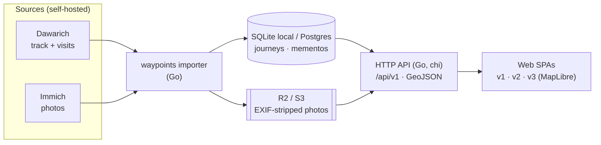

<div align="center">

# 🌼 felicia

**フェリシア** — 琉璃雏菊（蓝费莉菊）

_A map-based travel journal. The map is the index; the mementos are the stories._

Each **journey** is drawn on a world map as an orange route line. Along it sit **mementos** —
the little things that anchor a memory (a train ticket, a temple stamp, a plush, a receipt) —
each a collectible **stub** that animates open into an essay and a photo gallery.

Modeled on [liuaaron.com](https://liuaaron.com/) · _"Aaron's Waypoints."_

<br/>


%20%7C%20Postgres-00add8>)

[](LICENSE)

</div>

---

## ✨ The idea

- 🗺️ **The map is the index.** One glance says _everywhere I've been_ and _which trip to revisit_. You navigate spatially, not through a feed.
- 🎫 **Mementos, not tickets.** Physical stubs are dying, so a memento is `kind`-tagged (`ticket · transit · goods · stamp · receipt · souvenir`) and rendered from **data**, template-first — not scanned.
- 📍 **A place is a _visit_.** Following how [Dawarich](https://github.com/Freika/dawarich) and Google Timeline model location (`points → tracks → visits @ places → trips`), a _place_ is a dwell-time **visit** derived from your track. Several memories can stack at one place.
- ✍️ **Auto-ingest, then author.** A pipeline seeds _ingested_ fields (track, photos, stubs); you author the _essay, curation, and animation_. Re-import is field-scoped and **never clobbers** what you wrote.
- 🌏 **Japanese-first**, with English and Chinese alongside.

## 🚪 Three front doors, one contract

The web demo renders the **same** `{ journey, visit, memento }` fixtures three ways — proof the data contract is presentation-agnostic. Flip between them with the on-screen switcher (deep-linkable).

|     | Front door            | Route         | What it is                                                                                                                                               |
| --- | --------------------- | ------------- | -------------------------------------------------------------------------------------------------------------------------------------------------------- |
| 🗺️  | **v1 — Map reader**   | `/`           | liuaaron-aligned: journey rail → dark MapLibre map → paper detail. _The default._                                                                        |
| 🗄️  | **v2 — Collection**   | `#collection` | Memento-first shelf; a "greatest-hits" browse across every trip.                                                                                         |
| 📓  | **v3 — Techo (手帳)** | `#techo`      | Warm paper notebook: a journal-index spread, then the trip on a real map with mementos clustered by **place/visit** — open a place to read its memories. |

> The checked-in fixtures keep UI design work fast; the same shape is served by the working backend.

## 🏗️ Architecture



- **Ingest** — `waypoints` pulls the **track + visits** from Dawarich and **photos** from Immich, joins on timestamp, EXIF-strips + resizes to R2, and seeds stub mementos. Raw GPS never lands in a public file.
- **Serve** — the API layer depends on runtime ports; SQLite is the default local provider and PostgreSQL remains available for deployments that need it.
- **Read** — any number of frontends project the same contract. Adding a design is one registry entry, not a schema change.

## 🧱 Built with

Standing on a lot of excellent open source. 🙏

**🖥️ Web**
[Svelte 5](https://github.com/sveltejs/svelte) ·
[TypeScript](https://github.com/microsoft/TypeScript) ·
[Vite](https://github.com/vitejs/vite) ·
[MapLibre GL JS](https://github.com/maplibre/maplibre-gl-js) ·
[Tailwind CSS](https://github.com/tailwindlabs/tailwindcss) ·
[Bun](https://github.com/oven-sh/bun) ·
basemaps by [CARTO](https://carto.com/basemaps/) + [OpenStreetMap](https://www.openstreetmap.org/)

**⚙️ Backend**
[Go](https://go.dev) ·
[chi](https://github.com/go-chi/chi) ·
[pgx](https://github.com/jackc/pgx) ·
[sqlc](https://github.com/sqlc-dev/sqlc) ·
[orb](https://github.com/paulmach/orb) ·
[goose](https://github.com/pressly/goose) ·
[minio-go](https://github.com/minio/minio-go) ·
[imaging](https://github.com/disintegration/imaging) ·
[gpxgo](https://github.com/tkrajina/gpxgo) ·
[tzf](https://github.com/ringsaturn/tzf) ·
[koanf](https://github.com/knadh/koanf) ·
[go-toml](https://github.com/pelletier/go-toml) ·
[anthropic-sdk-go](https://github.com/anthropics/anthropic-sdk-go)

**🗃️ Data & storage**
[PostgreSQL](https://www.postgresql.org/) ·
[PostGIS](https://github.com/postgis/postgis) ·
Cloudflare [R2](https://developers.cloudflare.com/r2/) (S3-compatible; MinIO/B2 swappable)

**📥 Ingestion sources (self-hosted)**
[Dawarich](https://github.com/Freika/dawarich) (GPS track + visits) ·
[Immich](https://github.com/immich-app/immich) (photos)

**🧰 Tooling**
[Nix](https://nixos.org/) ·
[golangci-lint](https://github.com/golangci/golangci-lint) ·
[Docker Compose](https://docs.docker.com/compose/) ·
[Cloudflare Tunnel](https://developers.cloudflare.com/cloudflare-one/connections/connect-networks/) ·
[MkDocs Material](https://github.com/squidfunk/mkdocs-material) ·
[uv](https://github.com/astral-sh/uv)

## 🚀 Quick start

The web demo runs on fixtures — no database, no keys.

```bash
make web-dev          # Vite dev server → http://localhost:5173
```

Then use the switcher at the bottom (`地図 / コレクション / 手帳`), or jump straight in:
`/` (map) · `#collection` · `#techo`. Toggle language (日本語 / EN / 中文) and light/dark in each design's header.

```bash
make web-check        # svelte-check + eslint
make check            # Go workspace checks + uv feature-contract tests
```

> The complete toolchain comes from the **Nix** flake (`nix develop`). Everything routes through `make <target>`.

## 🧭 Data model in one breath

`journal → journeys → mementos`, with a derived **visit/place** layer and canonical media:

- **`memento`** — one uniform table, `kind`-tagged, kind-specifics in a `kind_data` jsonb. New kinds = a new enum value, not a new table.
- **`place = visit`** — a derived dwell-time cluster (consumed from Dawarich, or clustered from a GPX fallback); mementos anchor to the nearest visit.
- **Provenance is load-bearing** — every field is `INGESTED / OVERRIDABLE / AUTHORED`; the importer is field-scoped and re-import is always safe.
- **Media** — images, videos, audio, documents, links, and provider-approved embeds are canonical asset kinds attached to memories.
- **Locales** — system-owned UI labels use static `ja`/`en`/`zh` catalogs; user content is rendered exactly as authored.

Full detail: [`docs/research/data-model.md`](docs/research/data-model.md) · [`docs/research/backend-stack.md`](docs/research/backend-stack.md).

## 🛣️ Status & roadmap

**Implementation stage** (research trail continues). The backend pipeline is
substantially built and tested: SQLite/PostgreSQL providers with shared
contract tests, the field-scoped importer (Dawarich ⋈ Immich ⋈ local GPX),
the deterministic intake planner, the Go API (`/api/v1` + admin), the CLI
(`journey plan/apply/review`, `static compile`), and the published-only static
compiler. Remaining gaps: the admin authoring GUI (read-only shell today),
SQLite-backed GitHub Pages publication (fixture demo today), and the
deliberately deferred AI enrichment / object storage seams.

The single source of truth for delivery status is
[`docs/roadmap.md`](docs/roadmap.md) and the target end-to-end journey in
[`docs/roadmap/user-journey.md`](docs/roadmap/user-journey.md) — this README
no longer maintains its own checklist.

## 📚 Docs

- 🧭 North star — [`docs/direction.md`](docs/direction.md)
- 🔬 Research trail — [`docs/research/`](docs/research/)
- 🗄️ Parked drafts — [`docs/archive/`](docs/archive/)

Preview locally: `make docs` (uv-backed MkDocs Material).

## 🙏 Acknowledgements

- [liuaaron.com](https://liuaaron.com/) — the "Aaron's Waypoints" reference that started it all.
- [Dawarich](https://github.com/Freika/dawarich) & [Immich](https://github.com/immich-app/immich) — the self-hosted sources felicia is built to sit on.
- [CARTO](https://carto.com/) & [OpenStreetMap](https://www.openstreetmap.org/) contributors — the basemaps.

## 📄 License

[GNU AGPL-3.0](LICENSE) — network copyleft, matching the self-hosted sources felicia builds on
([Dawarich](https://github.com/Freika/dawarich) and [Immich](https://github.com/immich-app/immich)
are both AGPL-3.0). If you run a modified felicia as a network service, you must offer your users
its source.
