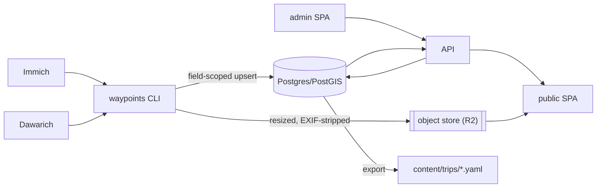

# Architecture — felicia

High-level system map. The authoritative design (rationale, data model, ingestion loop,
source-of-truth rule) is in [`design.md`](design.md); this is the structural orientation.

## Components

| Component | Path | Role |
| --- | --- | --- |
| `waypoints` CLI | `cmd/waypoints` | ingestion: import / sync / export / validate |
| API server | `cmd/api` | reads DB, serves data to the SPAs |
| Domain | `internal/domain` | pure entities + value types (TDD core) |
| Geo | `internal/geo` | LineString, Point, simplify, cluster |
| Sources | `internal/{exif,gpx,immich,dawarich,ocr}` | interface impls for photos, track, OCR |
| Importer | `internal/importer` | pipeline + field-scoped Patch types |
| Store | `internal/store/{pg,memrepo}` | Repository (Postgres canonical, memory for tests) |
| Object store | `internal/objectstore` | S3-compatible upload + image processing |
| Config | `internal/config` | TOML + env loading |
| Migrations | `migrations/` | PostGIS schema (goose) |
| Frontends | `web/{public,admin}` | Vite + Mapbox SPAs (bun workspace) |
| Deploy | `deploy/` | docker-compose, Dockerfiles, Cloudflare Tunnel |
| Content | `content/trips/` | `waypoints export` YAML backups (versioned) |

## Data flow

## Key invariants

- **DB is canonical**; importer touches ingested fields only, never authored ones.
- **Idempotent ingest**: content-addressed object keys; re-import yields zero writes on
  unchanged sources.
- **Privacy**: public images carry no EXIF; raw GPS stays in DB geometry only.
- **`internal/domain` is pure** — no I/O, no SDKs; the heart of the test suite.

## Dependencies (planned, minimal)

Postgres/PostGIS, an S3-compatible client, an EXIF reader, an image resizer, a GPX parser,
the Anthropic SDK (OCR). Pinned during implementation, kept lean.
