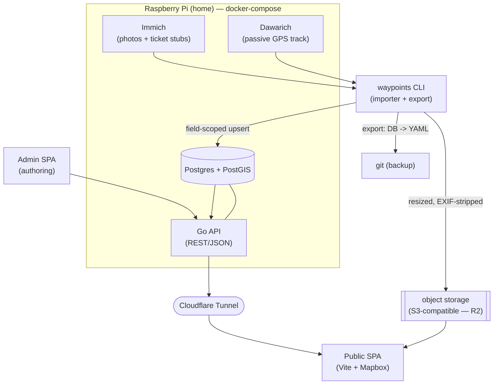
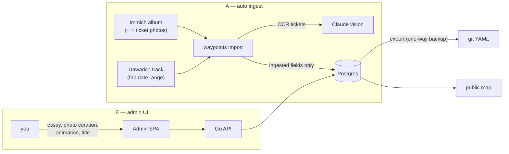
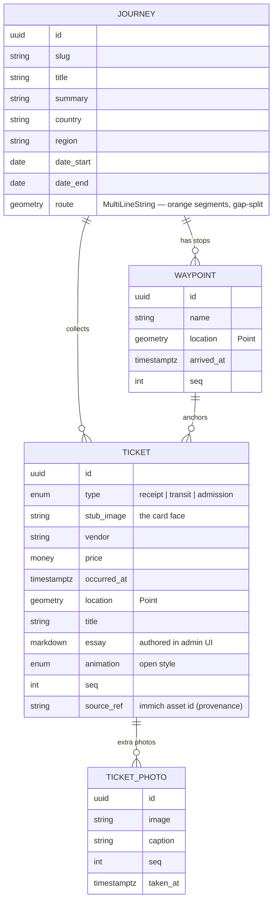
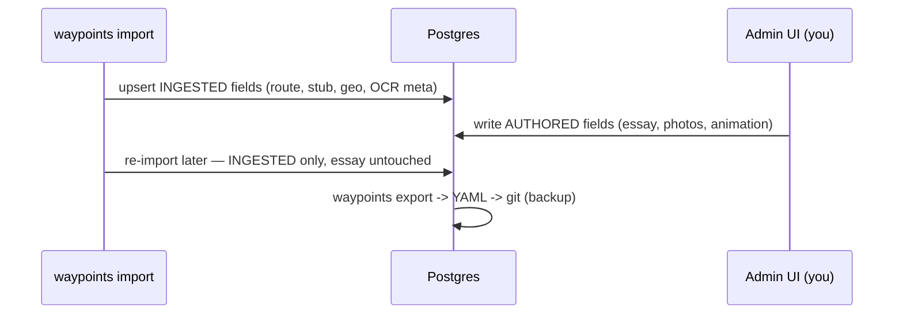

# felicia — Design

> A map-based travel journal, modeled on [liuaaron.com](https://liuaaron.com/)
> ("Aaron's Waypoints — a travel journal in ticket stubs"). This doc is the **current
> source of truth** for the design. Exploration notes that led here live in
> [`research/ingestion-workflows.md`](../research/ingestion-workflows.md); you don't need
> them to read this.
>
> Status: **design phase** — no implementation yet. Methodology: design → spec → TDD →
> build, deliberately unhurried (~6-month horizon).

Reference look: [`research/liuaaron-desktop.png`](../research/liuaaron-desktop.png) — dark
Mapbox basemap, an **orange route line** tracing the trip, and **ticket-stub cards**.

---

## 1. The product in one paragraph

A personal site where each **journey** is drawn on a dark world map as an orange route line.
Along the route sit a few **ticket stubs** — receipts, transit passes, admission tickets you
actually collected. The stub is the hero object: click it and it **animates open** into a
detail view with a written **essay** and a gallery of **extra photos**. The map is the
index; the tickets are the stories.

---

## 2. Architecture

| Layer | Choice | Notes |
| --- | --- | --- |
| **Backend** | Go API (REST/JSON) | strong TDD story; single binary |
| **DB** | Postgres + PostGIS | relational + real geo (route lines, points, bbox) |
| **Object storage** | **S3-compatible interface; R2 backend** | coded to an `ObjectStore` interface — R2/MinIO/B2 swappable by config |
| **Frontend** | SPA, Vite + Mapbox GL | public map site + a separate admin app |
| **Host** | Raspberry Pi, docker-compose | self-hosted, sovereign |
| **Public exposure** | Cloudflare Tunnel | no open ports on the home network |
| **Photo source** | self-hosted Immich (API) | a ticket stub is just a geotagged photo |
| **Route source** | self-hosted Dawarich + Overland (iOS) | passive phone logging; multi-day; Watch can't |

**Why not the Watch for routes:** Apple Watch GPS lasts hours, not multi-day trips. A
passive iPhone logger (significant-location-change) feeding **Dawarich** runs for days on
little battery, and exposes an API the importer queries by date range — the exact twin of
Immich for photos. (Watch workouts can still supply a precise GPX for a single hike segment.)

---

## 3. How data gets in — the A+E loop

Two halves, different jobs:

- **A — auto ingest (no toil):** the `waypoints` CLI pulls the **route** from Dawarich and
  **photos/tickets + EXIF** from an Immich album, runs **vision-LLM OCR** on ticket images
  to pre-fill `type / vendor / price / datetime`, derives **waypoints** by clustering, then
  upserts the DB and uploads resized images.
- **E — admin UI (authorship):** where *you* write the **essay**, curate & order the
  **extra photos** (drag-drop upload **or** an Immich picker), polish titles, and choose the
  ticket's open-**animation**.

### Per-trip ritual (steady state)

1. Travel — phone passively logs to Dawarich; photos auto-sync to Immich.
2. In Immich: make an album for the trip, ⭐/tag the ticket photos.
3. `waypoints import --immich-album "Jeju 2026"` — seeds the journey, route, tickets, photos.
4. In the admin UI: write each ticket's essay, arrange extra photos, pick the animation.
5. Done. Re-import anytime is safe (see §5).

---

## 4. Content & data model

The **Ticket is the hero / click target.** Closed = stub face + metadata; click =
animate open into essay + photo gallery.

---

## 5. Source-of-truth & the no-clobber rule

**Postgres is canonical.** Because both the importer *and* the admin UI write to it, fields
are split by **provenance** and the importer is **field-scoped** — it touches only what it
owns and never overwrites what you authored. Re-import is always non-destructive.

| Field group | Owner | Examples |
| --- | --- | --- |
| **Ingested** | `waypoints import` | `route`, `stub_image`, `location`, `occurred_at`, `type`, OCR'd `vendor`/`price`, `source_ref` |
| **Authored** | admin UI (you) | `title`, `essay`, `animation`, photo selection & order, `summary` |

**Backup / versioning:** a one-way `waypoints export` dumps DB → YAML into git on
commit/schedule. Git is a *versioned backup*, not the live store — so a wiped Pi means
"restore DB, re-import," not data loss.

---

## 6. Frontend (two apps)

- **Public SPA** — full-screen dark Mapbox map; orange route lines per journey; clickable
  ticket markers; `Newest ⇄ Oldest` sort; responsive (single column on mobile). Ticket click
  → animated detail panel (essay + photo gallery).
- **Admin SPA** — authenticated (you only). Journey/ticket CRUD, essay editor, photo
  curation via drag-drop upload **or** an Immich picker, animation picker, map preview.

**Stub rendering (decided 2026-06-12, after the [liuaaron teardown](../research/liuaaron-teardown.md)):**
the card face is a **type-template** — a few HTML/CSS ticket templates (receipt / transit /
admission) filled from the ticket's structured fields (OCR'd vendor/price/datetime) — with
the photographed stub as **fallback** when no template fits. Crisp and animatable like the
reference, zero per-ticket coding.

**Ticket-open animation** is per-ticket (`animation` enum), built animation-agnostic.
Candidates to prototype in the frontend milestone: **flip** (stub front / essay back),
**shared-element morph** (card grows into panel), **tear/unfold** (perforated stub).

---

## 7. TDD spine — where we start

The **importer** is the heart and the cleanest test target: pure functions over recorded
fixtures (saved Immich JSON + sample ticket images + a sample GPX), **no network in tests**.

First failing-test targets (smallest → biggest):

1. **GPX/track parse + simplify** → GeoJSON LineString (Douglas–Peucker). Pure.
2. **EXIF extract** (lat/lng/timestamp) from a sample image. Pure.
3. **Waypoint clustering** from a set of timestamped points. Pure.
4. **Ticket OCR mapping** — given a recorded vision-LLM response, map → `Ticket` fields.
5. **Field-scoped upsert** — re-import must not overwrite an authored `essay` (the no-clobber invariant).
6. **Immich client contract** — against recorded HTTP fixtures.

Each is a `bytes/records in → records/struct out` function behind an interface, so swapping
providers (manual files → Immich → Dawarich) never forces a rewrite.

---

## 8. Decision log

Locked (see rosemary `felicia:decision:*` for full ADRs):

- **architecture** — Go API + SPA; **A+E hybrid** (auto ingest + admin UI); DB canonical.
- **hosting** — Raspberry Pi + Cloudflare Tunnel; self-hosted.
- **ingestion** — Immich (photos) + Dawarich/Overland (route), joined on timestamp; vision-LLM OCR.
- **source-of-truth** — Postgres canonical; field-scoped importer; `export` → git backup.
- **content-model** — Journey → Ticket → {essay, extra photos, open-animation}; ticket is the click target.
- **storage** — code to an `ObjectStore` (S3-compatible) interface; **R2** is the current backend; MinIO/B2 swappable by config.
- **stub-rendering** *(2026-06-12)* — type-templates (HTML/CSS per ticket type) filled from structured fields; photographed stub as fallback. (liuaaron renders all tickets as components — see [teardown](../research/liuaaron-teardown.md).)
- **track-ingest** *(2026-06-12)* — **live**: Overland (iOS) / OwnTracks (Android) post to Dawarich mid-trip through an authenticated Cloudflare Tunnel hostname (Access service token + API key). Not buffer-at-home.
- **ticket-time-place** *(2026-06-12)* — stub capture is mixed (in-the-moment or hotel/home batch), so: `occurred_at` = OCR datetime > photo EXIF; `location` = route-snap at `occurred_at` > photo EXIF (importer-spec §9).
- **route-geometry** *(2026-06-12)* — `MultiLineString`, segments split on time gap > 60 min or jump > 50 km (nights, flights stay honest gaps). ([spec-gaps](spec-gaps.md) B2)
- **immich-marker** *(2026-06-12)* — ticket stubs marked with Immich **tag `ticket`**, not favorite. (spec-gaps A1)
- **admin-auth** *(2026-06-12)* — **Cloudflare Access** on the admin hostname; API verifies the Access JWT on `/api/admin/*`; no app-level auth. (spec-gaps D4)
- **field-classes** *(2026-06-12)* — provenance is **three** classes: INGESTED / OVERRIDABLE (importer writes until human edits, tracked per-row in `authored_fields`) / AUTHORED. Replaces the two-class table above where they conflict. (spec-gaps B1, importer-spec §7)

**Open:**

- **Ticket-open animation:** flip vs morph vs tear — prototype in frontend milestone.

Every remaining underspecified point is resolved (LOCKED or PROPOSED) in
[`spec-gaps.md`](spec-gaps.md) — the pre-TDD spec-freeze checklist lives there.

---

## 9. Next steps

1. Write the **importer spec** (`importer-spec.md`) — CLI surface, provider interfaces, pipeline, no-clobber upsert contract, fixtures plan.
2. **First failing Go tests** for the pure core (§7).
3. Stand up the **schema/migrations** (Postgres + PostGIS) behind the data model (§4).
4. Then iterate vertical slices: importer core → API → public map → admin UI.
