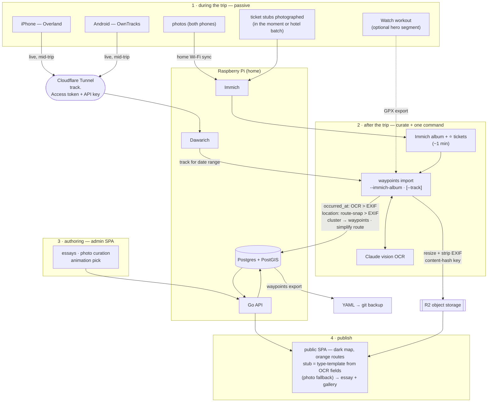

# Device-set walkthroughs — felicia

> Per-trip rituals by **device kit**. [`research/ingestion-workflows.md`](../research/ingestion-workflows.md)
> compared _approaches_ (A–E); this maps the chosen **A+E** loop onto the devices you
> actually carry. Decisions baked in (2026-06-12): **live track ingest** through the
> Cloudflare Tunnel, **template-rendered stubs with photo fallback**, **mixed stub
> capture** handled by precedence rules (OCR datetime > EXIF; location snapped to route).
>
> Kit on record: iPhone + Apple Watch + Android phone.

## The real workflow, end to end



## The invariant spine (every kit)

Devices only change **how the route and photos are captured**. Everything downstream is
identical:

1. **Collect** (passive) — GPS points flow to Dawarich; photos flow to Immich.
2. **Curate** (1 min) — Immich album per trip; ⭐/tag the ticket shots.
3. **Sync** (one command) — `waypoints import --immich-album "<Trip>"` joins track +
   photos on timestamp, OCRs tickets, clusters waypoints, uploads stripped images,
   field-scoped upsert. Re-run anytime; authored fields are untouchable.
4. **Author** (admin UI) — essays, photo curation, animation choice.
5. **Represent** — public SPA renders the orange route + template-rendered ticket stubs;
   click opens essay + gallery.

### One-time setup (live ingest, decided 2026-06-12)

- Expose Dawarich's ingest endpoint through the **Cloudflare Tunnel** on its own
  hostname (e.g. `track.<domain>`), locked down with **Cloudflare Access service
  token + Dawarich API key** — the track streams in near-real-time mid-trip.
- Immich stays LAN-only; photos sync when back on home Wi-Fi (or via VPN if desired).

---

## W1 — iPhone solo (the baseline)

**During the trip**

- **Overland** (iOS) posts significant-location-change points to
  `https://track.<domain>` continuously — battery-cheap, survives multi-day trips,
  buffers automatically through dead zones and flushes when back online.
- Photos: shoot normally; Immich app auto-backups (immediately on Wi-Fi, or queued
  until home).
- Ticket stubs: photograph **in the moment when you can** (best EXIF), or batch them
  at the hotel — precedence rules absorb either.

**After the trip**

```bash
# in Immich: album "Jeju 2026", ⭐ the ticket shots
waypoints import --immich-album "Jeju 2026" --dry-run   # review the plan
waypoints import --immich-album "Jeju 2026"
# then: admin UI — essays, photo order, animation
```

**Data quality** — route ★★★ (true track); stub time/place correct even for
hotel-batch captures (OCR datetime + route-snap).

---

## W2 — iPhone + Apple Watch (precision segments)

The Watch can't track a whole trip (GPS battery: hours), but a **workout recording of
one hike/ride** is far more precise than significant-location-change.

**During** — same as W1, plus: start a Watch workout for the segment you care about.

**After** — export that workout as GPX (HealthFit / WorkOutDoors), then:

```bash
waypoints import --immich-album "Jeju 2026" --track hike-hallasan.gpx
```

Route precedence (spec §9) puts the explicit GPX first for its time window; Dawarich
fills the rest of the trip. **Data quality** — route ★★★+, with a crisp hero segment.

---

## W3 — Android phone

Same spine, different logger — Dawarich speaks the **OwnTracks** protocol too.

**One-time** — install **OwnTracks** (or GPSLogger in OwnTracks-HTTP mode); point it at
the same tunnel hostname with its API key; set significant-changes mode.

**During / after** — identical to W1: photos via the Immich Android app, stubs mixed,
same two commands. The importer can't tell which phone produced the points — that's
the point of the `RouteSource` seam.

---

## W4 — Both phones on one trip

Both loggers post to the same Dawarich (distinct device IDs); both photo streams land
in the same Immich (one album). The importer's date-range pull merges everything on
timestamp — no extra steps. Useful when one phone is the local-SIM/navigation phone
and the other is the camera phone.

**Caveat** — two loggers double the GPS noise; if the merged line looks jittery, log
from one device per trip or filter by Dawarich device ID (flag idea for `import`,
decide when it bites).

---

## W5 — Fallback: no track ran

Forgot the logger / battery died / privacy day. The pipeline degrades instead of
failing:

- **No track at all** → the importer synthesizes a **photo-trail** route from geotagged
  photos in time order (sparse but honest), only when _no_ track source is configured —
  never as a silent fallback (spec §10).
- **Partial track** → Dawarich covers what it has; gaps stay gaps (see the open
  per-day-segments question, design §8).
- A later-found GPX (e.g. a friend's) can be added with `--track` — re-import is safe;
  the better route simply replaces the ingested one, essays untouched.

---

## Future kit — dedicated camera (no GPS)

Not in the current kit; noted for when it happens. Camera photos lack geotags but have
timestamps: upload to Immich, and the importer joins them against the Dawarich track at
shot time (the same route-snap used for tickets). Requirements: camera clock synced
(or a known offset), and a timezone rule for the join — both already needed for ticket
precedence, so the camera comes nearly free.
