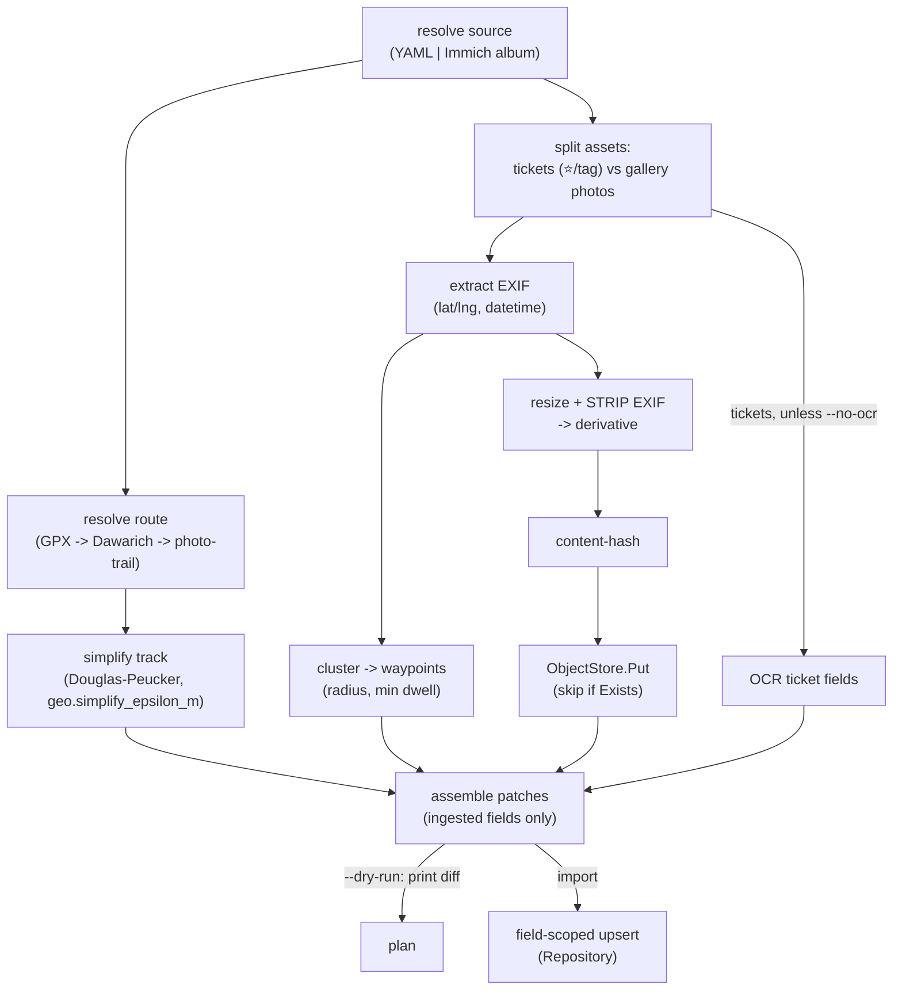

# felicia — Importer Spec (`waypoints` CLI)

> The spec for the ingestion tool. It is the contract the **TDD tests are derived from**.
> Reads on top of [`design.md`](./design.md); see §3 (A+E loop), §4 (data model), §5
> (no-clobber rule) there. Go signatures below are _sketches to pin shapes_, not final code.
>
> Status: **spec** — review before we write the first failing tests.
> **Amendments pending fold-in:** [`spec-gaps.md`](spec-gaps.md) resolves every known
> underspecified point (field classes, tz, snapping, OCR contract, YAML schema, …) and
> wins over this file where they disagree, until spec freeze merges them.

---

## 1. Scope & goals

`waypoints` is a Go CLI that turns a trip's raw materials (an Immich album + a Dawarich
track) into rows in Postgres and images in object storage — **idempotently** and
**without clobbering anything you authored in the admin UI** (§5 of design).

- **In scope (v1):** `import`, `sync`, `export`; Immich photo source; Dawarich route source;
  GPX file fallback; vision-LLM ticket OCR; image resize + EXIF strip + upload; field-scoped
  upsert; waypoint clustering; track simplification.
- **Out of scope (v1):** the admin UI, the public SPA, the HTTP API server, auth. (The
  importer writes the DB directly via the repository layer; the API reads it.)

**Build order rule (from design §3):** every external source sits behind an interface, so we
ship the **manual/file path first** (no Immich, no Dawarich) and add providers later with
zero rewrites.

---

## 2. CLI surface

```
waypoints <command> [flags]

  import   Ingest a trip into Postgres + object storage (idempotent).
  sync     Pull sources and emit/refresh a draft trip YAML for review (no DB writes).
  export   Dump DB -> per-trip YAML into the content repo (one-way backup).
  validate Check a trip YAML against the schema; exit non-zero on error.
```

### `import`

```
waypoints import [SOURCE] [flags]

SOURCE (one of):
  <path/to/trip.yaml>            import from a curated YAML (manual path / re-import)
  --immich-album "Jeju 2026"     import directly from an Immich album

flags:
  --track <file.gpx>             GPX overrides/supplies the route (else Dawarich, else photo-trail)
  --dry-run                      compute the plan; write nothing; print a diff
  --no-ocr                       skip vision-LLM; leave ticket metadata empty for manual fill
  --since / --until <date>       date-range override for the route pull (default: trip dates)
  --config <file>                config path (default: ./waypoints.toml or $WAYPOINTS_CONFIG)
```

### `sync`

```
waypoints sync --immich-album "Jeju 2026" [--track f.gpx] [--out content/trips/<slug>.yaml]
```

Pulls sources, runs OCR, derives waypoints/route, and writes a **draft YAML** for you to
review. Never touches the DB. Re-running merges into an existing draft (keeps your edits).

### `export`

```
waypoints export [--journey <slug>] [--out content/trips/]
```

Dumps canonical DB rows → YAML (including authored fields) for versioned backup.

**Exit codes:** `0` ok · `1` validation error · `2` source/network error · `3` partial
(some assets failed; details on stderr). `--dry-run` and `validate` never write.

---

## 3. Configuration

`waypoints.toml` (2-space indent) with env override (`WAYPOINTS_*`). Secrets via env only.

```toml
[database]
dsn = "postgres://felicia@localhost/felicia?sslmode=disable"  # env: WAYPOINTS_DATABASE_DSN

[storage]              # S3-compatible; R2 backend (design §2)
endpoint = "https://<acct>.r2.cloudflarestorage.com"
bucket   = "felicia"
public_base_url = "https://img.example.com"   # how the SPA references uploaded images
# access_key_id / secret via env: WAYPOINTS_STORAGE_ACCESS_KEY_ID / _SECRET_ACCESS_KEY

[immich]
base_url = "http://immich.lan:2283"            # api_key via env: WAYPOINTS_IMMICH_API_KEY

[dawarich]
base_url = "http://dawarich.lan:3000"          # api_key via env: WAYPOINTS_DAWARICH_API_KEY

[ocr]
provider = "anthropic"                         # api_key via env: ANTHROPIC_API_KEY
model    = "claude-..."                         # pin at implementation time

[geo]
simplify_epsilon_m   = 8       # Douglas-Peucker tolerance (meters)
cluster_radius_m     = 150     # waypoint cluster radius
cluster_min_dwell_min = 20     # min dwell to count as a stop

[image]
max_edge_px = 2000             # longest edge of public derivative
strip_exif  = true             # MUST stay true for public images (design §2)
```

---

## 4. Domain types (shape sketch)

```go
type Journey struct {
    ID        uuid.UUID
    Slug      string      // stable key, e.g. "2026-01-jeju"
    Title     string      // AUTHORED
    Summary   string      // AUTHORED
    Country   string
    Region    string
    DateStart civil.Date
    DateEnd   civil.Date
    Route     geo.MultiLineString // INGESTED — segments split on time/distance gaps (spec-gaps B2)
}

type Waypoint struct {
    ID        uuid.UUID
    JourneyID uuid.UUID
    Name      string         // INGESTED (reverse-geocoded), editable
    Location  geo.Point      // INGESTED
    ArrivedAt time.Time      // INGESTED
    Seq       int
}

type Ticket struct {
    ID         uuid.UUID
    JourneyID  uuid.UUID
    WaypointID *uuid.UUID
    Type       TicketType     // INGESTED (OCR), editable: receipt|transit|admission
    StubImage  ImageRef       // INGESTED
    Vendor     string         // INGESTED (OCR)
    Price      *Money         // INGESTED (OCR)
    OccurredAt time.Time      // INGESTED (OCR datetime > EXIF — §9)
    Location   geo.Point      // INGESTED (route-snap at OccurredAt > EXIF — §9)
    Title      string         // AUTHORED
    Essay      string         // AUTHORED (markdown)
    Animation  Animation      // AUTHORED
    Seq        int
    SourceRef  string         // INGESTED — Immich asset id (provenance/idempotency key)
}

type TicketPhoto struct {
    ID       uuid.UUID
    TicketID uuid.UUID
    Image    ImageRef    // INGESTED upload; selection/order AUTHORED
    Caption  string      // AUTHORED
    Seq      int         // AUTHORED
    TakenAt  time.Time   // INGESTED (EXIF)
    SourceRef string     // INGESTED
}

type Money struct { Amount int64; Currency string } // minor units, ISO-4217
type ImageRef struct { Key string; ContentHash string; Width, Height int }
```

`SourceRef` is the **idempotency key** for ingested rows (stable across re-imports).

---

## 5. Provider interfaces (the seams)

```go
// Photos + ticket stubs.
type PhotoSource interface {
    Album(ctx context.Context, name string) (Album, error) // assets + EXIF + favorite/tag flag
    Download(ctx context.Context, assetID string) (io.ReadCloser, error)
}

// The GPS route for a date range.
type RouteSource interface {
    Track(ctx context.Context, from, to time.Time) (geo.LineString, error)
}

// Pre-fill ticket metadata from a stub image.
type TicketOCR interface {
    Extract(ctx context.Context, img io.Reader) (TicketFields, error) // type, vendor, price, datetime
}

// S3-compatible object storage (design §2). R2 backend; MinIO/B2 swappable.
type ObjectStore interface {
    Put(ctx context.Context, key string, r io.Reader, contentType string) error
    Exists(ctx context.Context, key string) (bool, error) // content-hash key -> skip re-upload
}

// Persistence. Postgres impl; in-memory impl for tests.
type Repository interface {
    UpsertJourney(ctx, JourneyPatch) (uuid.UUID, error)
    UpsertWaypoints(ctx, journeyID, []WaypointPatch) error
    UpsertTickets(ctx, journeyID, []TicketPatch) error
    UpsertTicketPhotos(ctx, ticketID, []TicketPhotoPatch) error
}
```

Implementations: `immich.Client` (PhotoSource), `dawarich.Client` + `gpx.File`
(RouteSource), `anthropic.OCR` (TicketOCR), `s3store.Store` (ObjectStore), `pg.Repo` /
`memrepo.Repo` (Repository). The manual/file path uses a `fsphotos` PhotoSource that reads a
local folder — that's the v1 starting provider.

---

## 6. Pipeline



`sync` runs the same up to `assemble`, then writes/merges YAML instead of upserting.

---

## 7. No-clobber upsert contract (the load-bearing invariant)

Match existing rows by **`SourceRef`** (ingested) or `Slug` (journey).

Fields come in **three classes** (not two — see [`spec-gaps.md`](spec-gaps.md) B1; the
old ingested/authored split couldn't express "OCR pre-fill that a human may correct"):

| Class           | Importer                 | Admin UI  | Examples                                                                                      |
| --------------- | ------------------------ | --------- | --------------------------------------------------------------------------------------------- |
| **INGESTED**    | always writes            | read-only | route, stub_image, source_ref, taken_at, location                                             |
| **OVERRIDABLE** | writes until human edits | editable  | ticket type/vendor/price/occurred_at, waypoint name, ticket seq, journey country/region/dates |
| **AUTHORED**    | never writes             | owns      | title, essay, summary, animation, captions, photo selection/order                             |

- **Insert** (no match): write all INGESTED + OVERRIDABLE fields; AUTHORED fields take
  defaults (empty essay/title, default animation).
- **Update** (match): write INGESTED fields; write an OVERRIDABLE field only if its name
  is **not** in the row's `authored_fields text[]` (appended by the admin API whenever a
  human edits that field). **Never** write AUTHORED fields.
- **Deletion policy (v1):** assets removed from the source are **not** deleted from the DB
  (conservative — avoids nuking an authored entry behind a since-deleted Immich asset).
  Set `orphaned_at` for admin review; clear it if the asset reappears. _(revisit later)_

The `Patch` types encode the AUTHORED ban structurally: a `TicketPatch` simply **has no**
`Essay`/`Title`/`Animation` fields, so the upsert _cannot_ touch them. The OVERRIDABLE
filter is enforced in the repository against `authored_fields` — one code path, both impls
(`pg`, `memrepo`).

**Canonical test:** import → set an essay AND correct an OCR'd `vendor` (simulated admin
writes) → re-import with changed source data → essay and vendor unchanged, untouched
ingested fields refreshed.

---

## 8. Idempotency, hashing, image processing

- **Idempotency:** re-running `import` on unchanged sources yields **zero writes** (all
  `SourceRef` matches, all content hashes unchanged).
- **Object keys:** `journeys/<slug>/<kind>/<contentHash>.<ext>` — content-addressed, so an
  unchanged image is `Exists()`→skip. No overwrites, natural dedupe.
- **Derivatives:** resize longest edge to `image.max_edge_px`; **strip all EXIF** before
  upload (privacy — raw GPS stays only in the DB `Location` column). Keep original only in
  Immich, never public.

---

## 9. Geo rules

- **Route precedence:** explicit `--track` GPX → Dawarich track for date range → synthesized
  photo-trail (ordered geotagged photos). First available wins.
- **Simplify:** Douglas–Peucker at `geo.simplify_epsilon_m` (default 8 m) to keep the line
  light for the SPA.
- **Waypoints:** cluster ticket+photo points within `cluster_radius_m`; a cluster is a stop
  only if dwell ≥ `cluster_min_dwell_min`. Name via reverse-geocode (Immich-provided
  city/country first; geocoder fallback later).
- **Ticket time/place precedence (design §8):** stub photos may be captured long after the
  event (hotel/home batch), so photo EXIF can lie about both. `occurred_at` = OCR-extracted
  datetime when parseable, else EXIF. `location` = nearest route point at `occurred_at`
  (snap-to-route) when a track covers that time, else EXIF. Both pure functions — test
  targets alongside §11.

---

## 10. Error handling

- **Fail fast** on config/validation/auth (exit 1/2) — no partial DB writes.
- **Per-asset resilience:** one bad image (corrupt EXIF, OCR failure) is logged and skipped,
  not fatal; the run reports `3 (partial)` and lists failures on stderr.
- **`--dry-run`** prints the full plan (inserts/updates/uploads/skips) and writes nothing —
  the safe default to recommend in docs.
- **No silent fallback:** if a route source is configured but unreachable, error — don't
  quietly degrade to photo-trail. Photo-trail is only used when _no_ track source is
  configured/provided.

---

## 11. Test strategy & fixtures

Pure-core first, no network. Fixtures under `internal/importer/testdata/`:

- `immich/album.json` — recorded album response (assets + EXIF + flags).
- `immich/asset-*.jpg` — a few sample photos + ticket stubs (small, EXIF intact).
- `track/jeju.gpx` — sample GPS track.
- `ocr/ticket-*.json` — recorded vision-LLM responses (so OCR tests don't call the API).
- `golden/<slug>.yaml` — expected `sync` output (golden-file assertions).

First failing tests (smallest → biggest), each behind an interface, in-memory `Repository`:

1. `gpx.Parse` + `geo.Simplify` → known LineString.
2. `exif.Extract` → lat/lng/datetime from a sample asset.
3. `geo.Cluster` → waypoints from timestamped points (radius/dwell).
4. `ocr.Map` → `TicketFields` from a recorded LLM JSON.
5. **No-clobber upsert** (the §7 canonical test) on `memrepo`.
6. `immich.Client.Album` against recorded HTTP fixtures.
7. `sync` end-to-end on fixtures → matches `golden/<slug>.yaml`.

---

## 12. Gateway to implementation

Before tests are written we will, in a separate reviewed step:

- Purge the old Go/AWS content; re-init the module (path TBD, e.g. `github.com/<you>/felicia`).
- Lay out packages: `cmd/waypoints`, `internal/importer`, `internal/geo`, `internal/immich`,
  `internal/dawarich`, `internal/store`, `internal/ocr`.
- Add a `Makefile` (`make check`, `make test`) and pin tool versions.

Then: tests from §11, red → green, one at a time.
