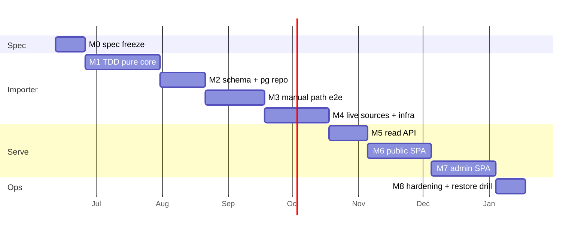

# Plan — felicia

Methodology: **design → spec → TDD → implementation**, unhurried (~6-month horizon,
Jun → Dec 2026). Vertical slices smallest → biggest; the importer core is the TDD
spine. Dates are **indicative pacing, not commitments** — milestones gate on exit
criteria, never on the calendar.

## Current phase

**M0 — spec freeze.** Design + importer spec written; every known underspecified
point resolved (LOCKED or PROPOSED) in [`spec-gaps.md`](spec-gaps.md); decisions
ADR'd in the graph (`felicia:decision:*`). No application code yet (by rule).

---

## M0 — Spec freeze *(now → late Jun)*

The gate before the first failing test. No code until this closes.

1. User reviews the **PROPOSED** items in `spec-gaps.md` (A2–A5, B3, B5–B7, C1–C5,
   D1–D3, E1) — veto or accept; silence = accept at freeze.
2. Execute the **fold-in checklist** (bottom of `spec-gaps.md`): merge resolutions
   into `importer-spec.md` / `design.md`; mark the register *frozen*.
3. Pick the module path; re-init `go.mod`; lay the package skeleton
   (`cmd/waypoints`, `internal/{domain,geo,exif,gpx,importer,store/memrepo,…}`,
   empty files only).

**Exit:** checklist fully checked; one frozen spec with zero "TBD"s; `make check`
green on the empty skeleton.

## M1 — Importer TDD pure core *(Jul)*

Red → green, one at a time, **no network, no DB, no clock** — fixtures only
(`internal/importer/testdata/`). Order (smallest → biggest):

1. `gpx.Parse` → timed points
2. `geo.Simplify` (Douglas–Peucker, epsilon 8 m)
3. `geo.GapSplit` → MultiLineString segments (60 min / 50 km — gaps B2)
4. `exif.Extract` → lat/lng/wall-clock
5. `tz.Resolve` — the A4 cascade; **cross-timezone fixture (KR→JP flight day)**
6. `geo.Cluster` → waypoints (150 m radius, 20 min dwell)
7. `geo.SnapToTrack` — bracket + interpolate, 30 min max gap (B4)
8. `importer.AnchorTickets` — dwell-window then radius (B5)
9. `ocr.Map` — recorded vision JSON → `TicketFields`, confidence < 0.6 → null (B7)
10. `importer.PhotoTrail` — synthesis rule (B6)
11. **Three-class no-clobber upsert** on `memrepo` — essay AND corrected vendor
    survive re-import (B1, the canonical test)
12. **Zero-diff idempotency** — second run: write count 0, put count 0 (C2)

**Exit:** all green under `go test -race`; `internal/domain` + `internal/geo` have
no I/O imports; fixtures committed.

## M2 — Schema & Postgres repository *(Aug)*

- goose migrations: 4 tables + PostGIS `MultiLineString`/`Point` columns,
  `authored_fields text[]`, `orphaned_at`, unique indexes per C1.
- `pg.Repo` passes the **same Repository contract test suite** as `memrepo`
  (one suite, two impls) against a dockerized PostGIS.
- Wire the migration smoke into `make validate`.

**Exit:** `make migrate` from a clean DB; contract suite green on both impls;
wipe-DB → re-migrate → re-import (memrepo fixture) proves the projection rebuilds.

## M3 — Manual path end-to-end (workflow D) *(Aug → Sep)*

- `fsphotos` PhotoSource (local folder, JPEG/PNG); `trip.yaml` per E1 +
  `waypoints validate` against an in-repo JSON Schema.
- Derivative pipeline: resize 2000 px, JPEG q82, strip-all, sha256 keys (C5);
  `s3store` against MinIO test container (R2 swap is config).
- `waypoints import <yaml>` + `--dry-run` diff + `export` round-trip.
- **Walking-skeleton spike** (timeboxed, throwaway allowed): hand-serve one
  journey's JSON and render the MultiLineString on a dark Mapbox page — de-risks
  the map rendering 3 months early.

**Exit:** golden e2e — sample trip folder → DB rows + objects; `export` output
matches `golden/<slug>.yaml`; the spike screenshot looks like the reference.

## M4 — Live sources + home infra *(Sep → Oct)*

Code: `immich.Client` (album, **tag `ticket`**, preview-JPEG download — A1/A5),
`dawarich.Client` (date-range pull), `anthropic.OCR` (recorded fixtures; one opt-in
live smoke behind an env flag), `sync` emitting draft YAML, route precedence wiring.

Infra (the per-trip ritual becomes real): Immich + Dawarich on the Pi;
`track.<domain>` tunnel hostname with Access service token + API key
(live-track-ingest decision); Overland on iPhone, OwnTracks on Android; pin
Immich/Dawarich versions and record their fixtures from those versions.

**Exit:** a real (or replayed) trip imports end-to-end from home services with one
command; re-import is a no-op.

## M5 — Read API *(Oct)*

- `cmd/api`: `GET /api/journeys`, `GET /api/journeys/{slug}` per D3; 4-decimal
  public rounding (D2); ETag/Cache-Control off `updated_at`.
- Cloudflare Access JWT verification middleware for `/api/admin/*` (D4) — verify
  only, no admin routes yet.

**Exit:** integration tests against seeded PostGIS; deployed on the Pi behind the
tunnel; public JSON visible from outside.

## M6 — Public SPA *(Oct → Nov)*

- Dark map, orange MultiLineString segments, ticket markers, journey sidebar with
  photo-count badges + `Newest ⇄ Oldest` (cheap wins from the teardown).
- **Stub type-templates** (receipt / transit / admission) fed by OCR fields +
  `extra` jsonb; photo fallback. Polaroid gallery + essay panel.
- Prototype the three open-animations (flip / morph / tear) → **settle the last
  open decision**, ADR it.

**Exit:** public site live with ≥1 real journey; animation decision closed;
Lighthouse sanity on mobile.

## M7 — Admin SPA *(Nov → Dec)*

- Access-gated app: essay editor, photo curation (drag-drop upload **and** Immich
  picker), animation picker, OVERRIDABLE-field editing wired to `authored_fields`,
  orphan review queue (C3).

**Exit:** the full A+E loop on a fresh trip — import, author, publish — without
touching SQL or the filesystem.

## M8 — Hardening & ops *(Dec)*

- `deploy/` compose for everything; scheduled `pg_dump` + `waypoints export` to git.
- Privacy zones configured (D1) and verified against a home-containing track.
- **Wipe-and-restore drill:** rebuild the Pi from compose + migrations + re-import +
  restore authored fields from export — proves the projection promise end to end.

**Exit:** drill passes; docs updated to as-built; project exits "unhurried build"
into "use it every trip".

---

## Cross-cutting rules

- `make check` before every commit, `make validate` before every PR (hook-enforced);
  frontend + migration gates join `validate` in M2/M6.
- Every non-obvious choice → `felicia:decision:*` ADR at decision time, not later.
- Fixtures are versioned artifacts: when Immich/Dawarich are pinned (M4), record
  fixture provenance (service version) in the fixture directory.
- One milestone in flight at a time; vertical-slice spikes are timeboxed and
  disposable.

## Risks & mitigations

| Risk | Mitigation |
| --- | --- |
| Immich/Dawarich API drift | pin versions (M4), recorded fixtures, interface seams |
| OCR quality/cost | confidence ≥ 0.6 or null; `--no-ocr` path; recorded fixtures keep tests free |
| HEIC / cgo on the Pi | sidestepped — Immich preview JPEGs (A5), pure-Go imaging |
| Public ingest endpoint (live tracking) | Access service token + API key; only Dawarich exposed; M8 drill checks policy |
| Frontend scope creep (animations) | M6 timebox; per-ticket enum keeps them additive |
| Solo-project stall | walking-skeleton spike in M3 for early visible payoff; exit criteria keep milestones small |

## Open decisions

- Ticket-open animation (flip / morph / tear) — closes in M6.
