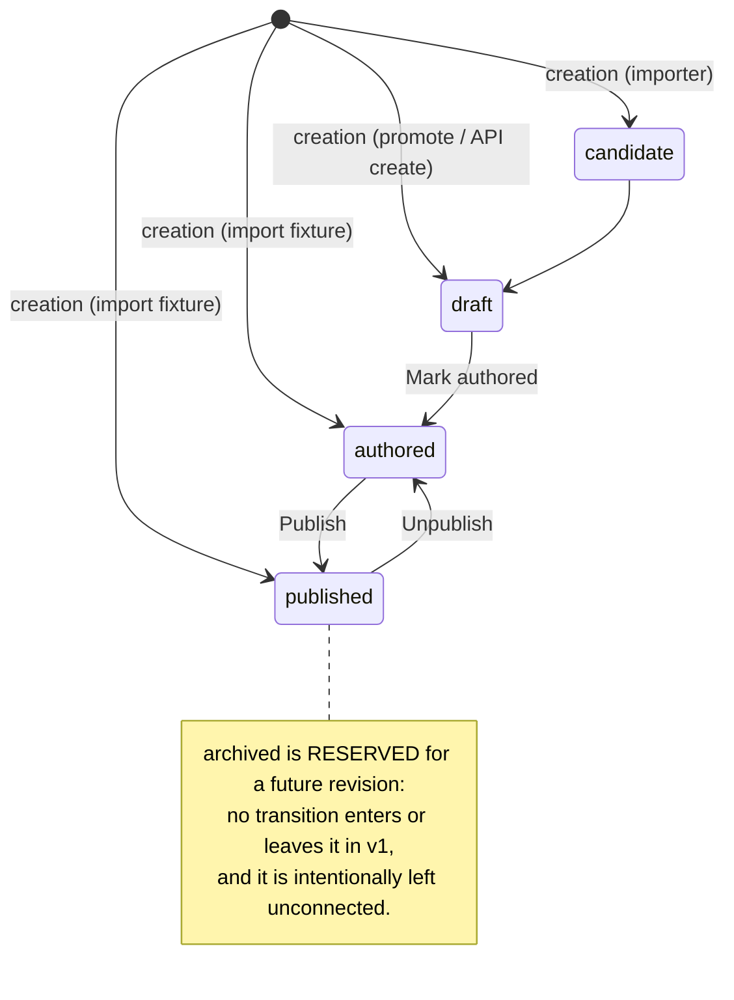

# Contract: Memento lifecycle and event view

This is a **binding engineering contract**. It is the single source of truth for the
memento lifecycle state machine and its **event view**: every event that changes a
memento's lifecycle state, the guard that MUST gate it, the resulting state, the side
effects (including automatic site rebuild), and the structured debug log that MUST
accompany it. Implementation — a transition table in `apps/felicia-core/domain`, provider- and
API-level guards, structured logs, and GUI auto-rebuild — will be written to satisfy
this document. Where the current code diverges from a rule below, the code MUST change;
this document wins. `status: proposed` because it is pending human confirmation before
the implementing code lands. Normative keywords (**MUST**, **MUST NOT**, **MAY**) carry
their RFC 2119 meaning.

## 1. State inventory

`MementoState` is a Go string enum (`apps/felicia-core/domain/entity.go`) mirrored in TypeScript
(`apps/felicia-web/src/api.ts`). The five states, their operational meaning, and who
produces them:

| State       | Meaning                                                   | Produced by                                                                           |
| ----------- | --------------------------------------------------------- | ------------------------------------------------------------------------------------- |
| `candidate` | Source-derived, awaiting authoring; not publicly visible. | Importer creation (ingested rows).                                                    |
| `draft`     | Editable, incomplete allowed; not publicly visible.       | Promote a stop-candidate; API create; `candidate→draft`.                              |
| `authored`  | Complete and review-ready; not publicly visible.          | GUI "Mark authored" (`draft→authored`); GUI "Unpublish" (`published→authored`).       |
| `published` | Exposed to the public/static site.                        | GUI "Publish" (`authored→published`); importer fixtures created directly `published`. |
| `archived`  | **Reserved.** No writer in v1; defined-but-dead.          | Nothing (see §3, §10).                                                                |

## 2. State diagram

## 3. Transition table

Legal single-step transitions in v1 are exactly the forward chain plus the one
backward step (unpublish). Same-state (`X→X`) is **always** legal (no-op saves,
re-imports). **Creation** (no prior row) MAY set any state. Everything else is illegal
and MUST be rejected. `archived` is reserved: no transition MAY enter or leave it.

| From                | To                                                | Legal?     | Trigger(s)                                  |
| ------------------- | ------------------------------------------------- | ---------- | ------------------------------------------- |
| _(none / creation)_ | any of `candidate`/`draft`/`authored`/`published` | MUST allow | Importer package apply; promote; API create |
| _(none / creation)_ | `archived`                                        | MUST NOT   | No writer exists (reserved)                 |
| `candidate`         | `draft`                                           | MUST allow | Begin authoring                             |
| `draft`             | `authored`                                        | MUST allow | GUI "Mark authored"                         |
| `authored`          | `published`                                       | MUST allow | GUI "Publish"                               |
| `published`         | `authored`                                        | MUST allow | GUI "Unpublish"                             |
| any `X`             | same `X`                                          | MUST allow | Plain save; re-import at same state         |
| `draft`             | `published`                                       | MUST NOT   | Skips review (`authored`)                   |
| `candidate`         | `authored`/`published`                            | MUST NOT   | Skips step(s)                               |
| `published`         | `draft`/`candidate`                               | MUST NOT   | Backward beyond unpublish                   |
| `authored`          | `draft`/`candidate`                               | MUST NOT   | Backward beyond unpublish                   |
| any                 | `archived`                                        | MUST NOT   | Reserved (no v1 activation)                 |
| `archived`          | any                                               | MUST NOT   | Reserved (no v1 writer)                     |

An illegal transition MUST be rejected with **HTTP 422** and a single validation issue
`{Field: "state", Code: "invalid_transition"}` (the new `domain.CodeInvalidTransition
= "invalid_transition"`), surfaced inline in the GUI next to the state control.

### Deletion (a gated terminal action, not a state)

Deletion is **not** a lifecycle transition and there is no `deleted` state; it is a
terminal action that removes the row. It MUST be permitted **only** from `candidate`,
`draft`, or `authored`. Deleting a `published` memento MUST be rejected — the author
MUST unpublish it first (`published→authored`) and then delete. `archived` is
reserved and non-deletable in v1. A forbidden delete MUST return **HTTP 422** with
`{Field: "state", Code: "delete_requires_unpublish"}`. On a permitted delete the row
and its files are **not** preserved: photos cascade, no tombstone is written. Because
a deletable memento is never public, deletion never crosses the published boundary and
therefore never triggers a rebuild (§6).

## 4. Event view

The core table. One row per state-changing event. "Entry point" cites the real
endpoint/handler or code path; "Guard" is the control that MUST gate the transition;
"Side effects" state cache invalidation and, where the published boundary (§6) is
crossed, the automatic rebuild and its `artifact_ready` precondition; "Debug log"
gives the `source` label and `from→to` (§8).

| Event                        | Entry point (endpoint / code path)                                                                | Guard (control)                                                                                                                                       | Resulting state                                  | Side effects                                                                                          | Debug log                                                              |
| ---------------------------- | ------------------------------------------------------------------------------------------------- | ----------------------------------------------------------------------------------------------------------------------------------------------------- | ------------------------------------------------ | ----------------------------------------------------------------------------------------------------- | ---------------------------------------------------------------------- |
| Importer create              | Importer package apply → `Repository.ApplyIngestMementoPatch` / `ApplyManualMementoPatch`         | Creation is unconstrained (any state); a re-import that would move an existing row backward MUST fail as `invalid_transition` (§7)                    | as carried by package (`candidate`..`published`) | Cache invalidation. No auto-rebuild (CLI policy note, §6).                                            | `source=importer`, `from=(new)→to=<state>` (or `from→to` on re-import) |
| Promote stop-candidate       | `POST /api/admin/stop-candidates/{id}/promote` → `handlePromoteStopCandidate`                     | Creation; state fixed to `draft`                                                                                                                      | `draft`                                          | Cache invalidation.                                                                                   | `source=promote`, `from=(new)→to=draft`                                |
| GUI "Mark authored"          | `POST /api/admin/mementos` → `handleUpsertMemento` (`nextLifecycleState: draft→authored`)         | Transition table + `ValidateForState` completeness                                                                                                    | `authored`                                       | Cache invalidation. No rebuild (not on published boundary).                                           | `source=admin-api`, `from=draft→to=authored`                           |
| GUI "Publish"                | `POST /api/admin/mementos` → `handleUpsertMemento` (`nextLifecycleState: authored→published`)     | Transition table + `ValidateForState` completeness                                                                                                    | `published`                                      | Cache invalidation. Marks the memento **pending-build** (staged; no eager rebuild — §6).              | `source=admin-api`, `from=authored→to=published`                       |
| GUI "Unpublish"              | `POST /api/admin/mementos` → `handleUpsertMemento` (`previousLifecycleState: published→authored`) | Transition table                                                                                                                                      | `authored`                                       | Cache invalidation. Marks the memento **pending-build** (staged; no eager rebuild — §6).              | `source=admin-api`, `from=published→to=authored`                       |
| GUI plain save (same-state)  | `POST /api/admin/mementos` → `handleUpsertMemento`                                                | Same-state always legal; `ValidateForState` for the current state                                                                                     | unchanged (`X→X`)                                | Cache invalidation. Not pending-build (no visibility change).                                         | `source=admin-api`, `from=X→to=X`                                      |
| API upsert (arbitrary state) | `POST /api/admin/mementos` → `handleUpsertMemento`                                                | Transition table (reject non-legal step with `invalid_transition`, 422) + `ValidateForState`                                                          | requested state if legal, else rejected          | Cache invalidation on success; a legal step crossing the published boundary marks pending-build (§6). | `source=admin-api`, `from=<current>→to=<target>`                       |
| Delete                       | `DELETE /api/admin/mementos/{id}` → `handleDeleteMemento`                                         | Permitted only from `candidate`/`draft`/`authored`; a `published` memento is rejected (422 `delete_requires_unpublish`); photos cascade; no tombstone | removed                                          | Cache invalidation. No auto-rebuild (a deletable memento is never public).                            | `source=admin-api`, `from=<state>→to=deleted`                          |

## 5. Defaulting rule

There is exactly one normative rule for a missing `state`:

- On an **existing** memento, omitting `state` MUST mean "keep the current state." It
  MUST NOT silently default to `draft`.
- Only a **brand-new** memento with no prior row and no `state` defaults to `draft`.

The SQLite/PostgreSQL column default (`published`) is legacy and irrelevant: every
write path sets `state` explicitly, so the column default is never the effective value.
The current `handleUpsertMemento` behaviour (unconditionally defaulting missing state to
`MementoDraft`) MUST be replaced by the rule above.

## 6. Staged rebuild (pending-build tracking)

Publish and unpublish do **NOT** eagerly rebuild the artifact — batch-editing many
mementos would otherwise recompile on every toggle. Instead, a change that would alter
the public site is tracked as **pending-build**, surfaced to the author, and resolved
by an explicit one-click build. This is a staged model: edit freely, build when ready.

**Published boundary** = a change to whether a memento is publicly visible, i.e. a
`published↔authored` toggle (`authored→published`, `published→authored`). These are the
only changes that count as pending-build.

**Pending-build definition (visibility-only):** a memento is pending-build iff its
current published-visibility differs from the **deployed artifact** — computed by
comparing the DB's set of `published` memento IDs against the IDs present in the
artifact's `api/v1/journeys/<id>/mementos.json` (the artifact is the source of truth
for "what is deployed"; this is stateless and self-correcting — no dirty flag, no
drift). When no artifact exists yet (`artifact_ready == false` from
`GET /api/admin/site`), nothing is pending — the first build establishes the baseline.

Consequences of visibility-only tracking (per the confirmed decision):

- Same-state saves are never pending-build, including **in-place edits of a still-
  `published` memento** (e.g. changing its essay). Such edits will not be flagged, so
  the deployed content can lag. The recommended discipline is **unpublish → edit →
  republish**: the unpublish and republish are visibility toggles and therefore ARE
  tracked, and the delete-requires-unpublish rule (§3) already nudges authors toward
  unpublishing before mutating public content.
- Delete is never pending-build: deletion is restricted to non-public states (§3), so
  it can never change what is public.

Rules:

- The GUI MUST surface pending-build state at two levels: (a) each pending memento is
  highlighted in the journey's memento list, and the journey-detail Build action shows
  the pending count; (b) each journey with pending mementos is highlighted in the
  journeys list, and the list page shows a Build action with the count of pending
  journeys.
- The build itself is `POST /api/admin/compile` (`compileSite` → `handleCompile`),
  whose manifest reconciliation removes content no longer published and adds newly
  published content — clearing all pending-build indications for what it built. The GUI
  MUST surface build status (in progress / succeeded / failed).
- **CLI policy note (v1):** CLI writers are not tracked. After any CLI write that
  crosses the published boundary, the operator MUST run `felicia static compile`.
  Server-side pending tracking for CLI is out of scope (§10).

This closes the motivating defect (unpublish/delete previously left the deployed
artifact stale) without recompiling on every toggle: the drift is always visible as a
pending count and resolved in one action.

## 7. Re-import downgrade

Re-import is safe for same-state and forward cases, but MUST fail loudly on a
downgrade: if a re-imported package's recorded state is behind the DB (e.g. DB
`published`, package `draft`), that is an illegal transition and MUST be rejected as
`invalid_transition` rather than silently unpublishing the memento.

## 8. Logging

Every state-changing event MUST emit one structured debug log with this fixed field
set:

| Field        | Value                                     |
| ------------ | ----------------------------------------- |
| `memento_id` | the memento UUID                          |
| `journey_id` | the owning journey UUID                   |
| `from`       | prior state; `(new)` on creation          |
| `to`         | resulting state; `deleted` on delete      |
| `revision`   | post-write revision                       |
| `source`     | one of `admin-api`, `promote`, `importer` |

`source` vocabulary: `admin-api` (the upsert/delete endpoints), `promote` (stop-candidate
promotion), `importer` (package apply). A delete uses `to=deleted`.

This is debug/observability logging only. It is **not** an audit table: this contract
introduces no authoring event-log table (§10). The "event view" is this document plus
these structured logs.

## 9. Guarantees / invariants

- The public site MUST show only `published` mementos (`publication.PublishedMementos`
  is the single gate); a journey with zero published mementos has no public projection.
- The deployed artifact is refreshed by an explicit build, not by each publish/
  unpublish. Every published-boundary change since the last build MUST be surfaced as a
  pending-build indication (memento- and journey-level) so the author can rebuild in one
  action; the artifact therefore never drifts _silently_ (§6).
- Illegal transitions MUST be rejected uniformly (HTTP 422, `invalid_transition`)
  across all providers and all clients — the guard lives at the domain/write seam, not
  only in the GUI.
- Creation MUST remain unconstrained: importer fixtures, promote, and API create MAY
  set any state.
- A `published` memento MUST NOT be deleted directly; it MUST be unpublished first, so
  deletion never bypasses the published-boundary rebuild (§3, §6).
- Re-import MUST NOT silently downgrade a memento (§7).

## 10. Out of scope (v1)

- Activating or transitioning into/out of `archived`.
- An authoring audit / event-log table (only import-run tables exist).
- Backward steps other than unpublish (`published→authored`).
- Server-side automatic rebuild for CLI writes (covered by policy note, §6).
- Per-actor attribution in the lifecycle log.
