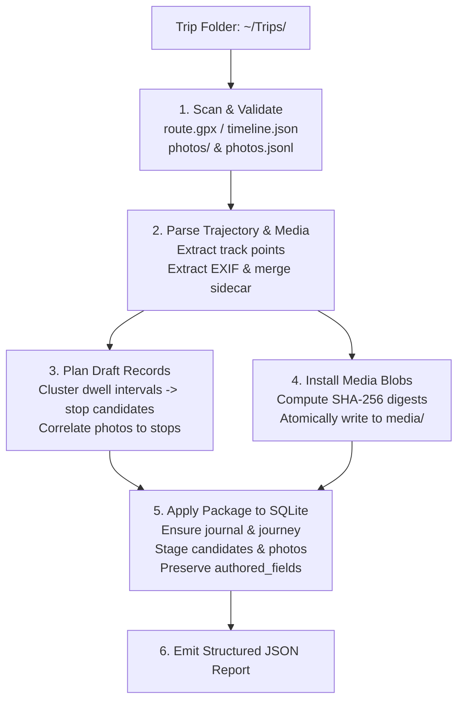
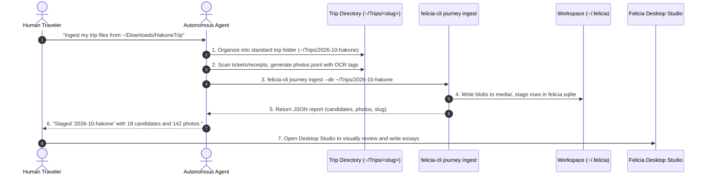

# Contract: Trip folder intake and agent workflows

This document defines the normative contract for the **trip folder** filesystem convention, the single-step `felicia-cli journey ingest` command, and autonomous agent toolbelt workflows.

The trip folder serves as the headless staging boundary between raw travel capture files (GPS logs, visit exports, and digital photos) and Felicia's persistent workspace storage (`felicia.sqlite` and the content-addressed media blob store).

---

## 1. Directory layout contract

A staged trip directory contains raw evidence for a single journey:

```text
<trip-folder>/
├── route.gpx                 # GPS track log (required if no timeline.json)
├── timeline.json             # Google Timeline visit export (required if no route.gpx)
├── photos/                   # Image files (up to 20 MiB each)
│   ├── DSC04921.JPG
│   ├── DSC04922.JPG
│   └── PXL_20261001_143012.webp
└── photos.jsonl              # Optional metadata overrides (JSON Lines)
```

### File specifications

| File / Directory | Status | Specification |
| ---------------- | ------ | ------------- |
| `<trip-folder>` (directory) | Required | Root folder name serves as the default journey slug (e.g., `2026-10-hakone`). |
| `route.gpx` | Conditional | Standard GPX track log with `<trkpt>` elements containing WGS 84 coordinates (`lat`, `lon`) and ISO 8601 timestamps (`<time>`). If `route.gpx` is not present, the scanner selects the first alphabetical `*.gpx` file in the folder root. Required if `timeline.json` is absent. |
| `timeline.json` / `Timeline.json` | Conditional | Google Timeline JSON visit export. Accepted as an alternative or complement to GPX route tracks. Required if no GPX file is present. At least one of GPX or Timeline is required. |
| `photos/` | Optional | Subdirectory containing unedited trip images. Supported formats: `.jpg`, `.jpeg`, `.png`, `.webp` (case-insensitive). Maximum size per image: **20 MiB**. Top-level images in `<trip-folder>` are discovered automatically if the `photos/` subdirectory is absent. |
| `photos.jsonl` | Optional | JSON Lines sidecar supplying metadata overrides for photos. |

### Sidecar format (`photos.jsonl`)

The sidecar allows humans or automated agents to inject missing metadata, correct inaccurate timestamps, override coordinates, or attach initial titles and captions. Each line must be a valid JSON object.

```jsonl
{"path":"photos/DSC04921.JPG","at":"2026-10-01T14:30:12+09:00","coord":[139.0411,35.2323],"title":"Hakone Tozan Railway ticket"}
{"path":"DSC04922.JPG","at":"2026-10-01T15:10:00+09:00","coord":[139.0520,35.2380],"caption":"View of Mount Fuji from ropeway"}
```

#### Supported fields

| Field | Type | Description |
| ----- | ---- | ----------- |
| `path` | String | Relative path to the image file. Can be prefixed with `photos/` or just the filename (e.g., `"photos/IMG_001.jpg"` or `"IMG_001.jpg"`). |
| `filename` | String | Fallback alias for `path`. |
| `at` | String | Capture instant formatted as an RFC 3339 / ISO 8601 string (e.g., `"2026-10-01T14:30:12+09:00"`). Overrides EXIF capture timestamp. |
| `timestamp` | String | Fallback alias for `at`. |
| `coord` | Array of Number | Geographical coordinate in `[longitude, latitude]` order (WGS 84). Longitude must be in `[-180, 180]`; latitude must be in `[-90, 90]`. Overrides EXIF GPS tags. |
| `lat`, `lon` | Number | Optional alternative to `coord`. If `coord` is omitted and both `lat` and `lon` are specified, the scanner constructs `[lon, lat]`. |
| `title` | String | Human- or agent-assigned title for the photo asset. |
| `caption` | String | Fallback alias for `title`. |
| `kind` | String | Optional media kind string (defaults to `"image"`). |

#### Sidecar fault tolerance

- Malformed or invalid JSON lines are skipped without halting ingestion.
- Unsafe paths containing directory traversal (`..`) or absolute paths are rejected.
- Paths are resolved case-insensitively and matched against both relative paths and basenames.

---

## 2. Single-step CLI command

The `felicia-cli journey ingest` command performs discovery, route parsing, photo EXIF extraction, dwell-time clustering, content-addressed media installation, and database staging in a single operation.

### Syntax

```bash
felicia-cli journey ingest --dir <path> [options]

# Positional path shorthand:
felicia-cli journey ingest <path> [options]
```

### Options

| Flag | Type | Default | Description |
| ---- | ---- | ------- | ----------- |
| `--dir <path>` | String | *(Positional)* | Path to the trip folder containing track logs and photos. |
| `--workspace <path>` | String | Derived | Path to the Felicia workspace root directory. |
| `--db <path>` | String | `<workspace>/felicia.sqlite` | Path to the target SQLite database file. |
| `--media-root <path>` | String | `<workspace>/media` | Directory for the private content-addressed media blob store. |
| `--slug <slug>` | String | Basename of `--dir` | URL-safe journey slug identifier. |
| `--title <title>` | String | Derived | Journey display title. Defaults to existing journey title or title derived from slug. |
| `--place <place>` | String | Derived | Primary location or region label. Defaults to existing place or journey title. |
| `--from <rfc3339>` | String | None | Optional RFC 3339 timestamp filter for lower bound of track and photo import. |
| `--to <rfc3339>` | String | None | Optional RFC 3339 timestamp filter for upper bound of track and photo import. |

### Workspace resolution order

When `--workspace` is not explicitly supplied, `felicia-cli` resolves the active workspace following this precedence:

1. Explicit `--workspace <path>` flag.
2. `FELICIA_WORKSPACE` environment variable (if non-empty).
3. Local `.felicia` directory in the current working directory (if it exists and is a directory).
4. Default `~/.felicia` directory in the user's home directory.

Managed subdirectories (`media/`, `site/`, and database parent directory) are automatically created with `0755` permissions if they do not exist.

---

## 3. Pipeline execution and behavior



### Ingestion stages

1. **Discovery and Validation**:
   Checks that `<trip-folder>` exists and contains either `route.gpx` or `timeline.json`. If neither is found, ingestion aborts immediately.
2. **Identity Resolution**:
   Resolves the target journey slug. If a journey with the slug already exists in `felicia.sqlite`, its existing IDs, journal associations, and titles are preserved. Otherwise, a new UUIDv7 journey ID and journal association are created.
3. **Trajectory and Metadata Extraction**:
   Parses GPX tracks or Google Timeline visits. Reads photo EXIF metadata (DateTimeOriginal, GPS latitude/longitude) and merges any explicit fields from `photos.jsonl`.
4. **Draft Planning**:
   Identifies stationary dwell intervals along the trajectory to propose stop candidates. Correlates photo capture times with track locations.
5. **Content-Addressed Media Installation**:
   Calculates SHA-256 digests of all discovered image files. Installs unique files into `mediaRoot` under `<objectKey>` using atomic temporary writes (`0600` permissions). Deduplicates identical files by hash.
6. **Database Staging (Authorship Protection)**:
   Commits the journey, stop candidates, and photo records into SQLite. Re-ingesting an existing trip is fully idempotent: fields listed in `authored_fields` (such as human-edited titles, curated stops, or memento essays) are never overwritten ([ADR 0004](../adr/0004-authorship-protection-and-intake-seam.md)).

---

## 4. Output format and error handling

### Structured JSON output

Upon successful ingestion, `felicia-cli journey ingest` writes a single JSON object to `stdout`:

```json
{
  "mode": "ingest",
  "journey_id": "0192634e-8f2c-7431-b842-749e7cf93d8b",
  "slug": "kyoto-2026",
  "candidates": 5,
  "mementos": 4,
  "photos": 12,
  "conflicts": []
}
```

#### JSON fields

| Field | Type | Description |
| ----- | ---- | ----------- |
| `mode` | String | Constant `"ingest"`. |
| `journey_id` | String | Canonical UUID of the created or updated journey. |
| `slug` | String | URL-safe journey slug. |
| `candidates` | Integer | Total count of stop candidates proposed from track dwell times. |
| `mementos` | Integer | Total count of draft mementos created. |
| `photos` | Integer | Total count of unique photo assets installed into media storage. |
| `conflicts` | Array of String | Conflict warnings encountered during ingestion, if any. |

### Error handling and exit codes

- On success, the CLI exits with status code `0`.
- On failure, the CLI exits with status code `1` and prints an error message to `stderr` prefixed with `felicia: `.

Common error cases:

| Error condition | Exit code | Output |
| --------------- | --------- | ------ |
| Missing `--dir` argument | `1` | `felicia: usage: felicia-cli journey ingest [--dir] <path> [options]` |
| Directory does not exist | `1` | `felicia: trip directory "<path>" does not exist` |
| Neither GPX nor Timeline present | `1` | `felicia: trip folder requires route.gpx or timeline.json` |
| Invalid `--from` or `--to` format | `1` | `felicia: --from: parsing time "..." as "...": cannot parse ...` |
| Database connection failure | `1` | `felicia: open database <path>: <reason>` |

---

## 5. Agent toolbelt workflows

Autonomous AI coding agents operating in terminal environments can automate the entire ingestion lifecycle.



### Automation recipe for agents

1. **Stage incoming files**:
   Create a dedicated directory under `~/Trips/<slug>` or the project's staging area. Move the recorded GPS track to `route.gpx` and move all images into a `photos/` subdirectory.
2. **Synthesize `photos.jsonl` (optional)**:
   - For photos lacking EXIF timestamps or GPS tags, align them against the GPX track timeline or user notes.
   - For scanned transit stubs, tickets, or restaurant receipts, extract text via OCR and provide initial titles or timestamps in `photos.jsonl`.
3. **Execute single-step ingest**:
   Invoke `felicia-cli journey ingest --dir <path>`. Ensure `--workspace` points to the user's active workspace (or let it default to `~/.felicia`).
4. **Inspect output**:
   Parse the structured JSON output. Confirm `photos > 0` and `conflicts` is empty. Report the journey slug and candidate count back to the user.
5. **Human handoff**:
   Inform the user that the trip is staged. The human author launches Felicia Desktop Studio, which directly reads `~/.felicia/felicia.sqlite` to review stop candidates, curate mementos, author personal stories, and trigger static publication.
