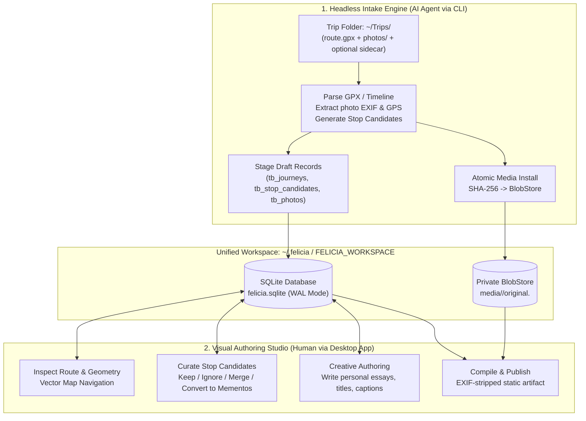
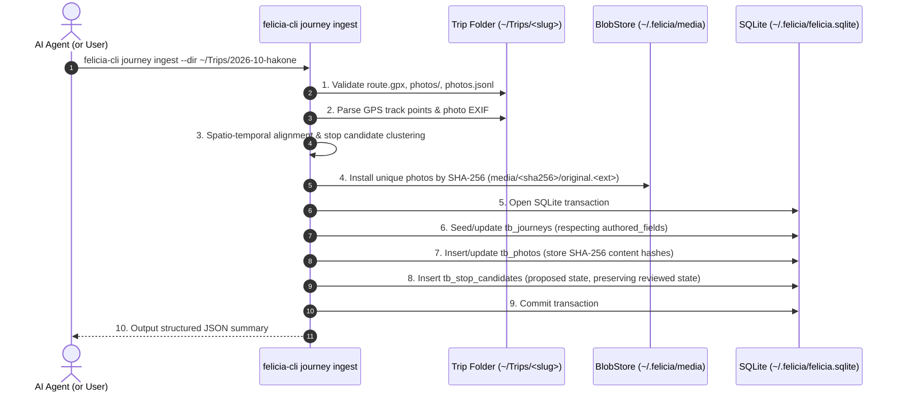

# Agent and Desktop Studio Workflow

This document establishes the collaborative architecture between **autonomous AI agents** operating in the terminal and the native **Desktop Studio** authoring environment.

By defining an asymmetrical division of labor, a standardized workspace boundary, a clean file contract, and robust authorship protections, Felicia enables seamless travel journaling: an AI agent performs the tedious, headless intake of sensor and photo data, while the human author uses the visual desktop app for reflective storytelling, cartographic curation, and publication.

---

## 1. Mental Model: Asymmetric Division of Labor

A common anti-pattern in personal tooling is forcing either human authors to run low-level CLI parsing scripts or forcing AI agents to interact with graphical UI windows. Felicia decouples the workflow along the natural competencies of each actor:



### The AI Agent: Headless Intake Engine

The AI agent (invoked via terminal CLI, background job, or session assistant) acts as a high-throughput, headless intake pipeline:

- **Sensor and Log Parsing**: Ingests raw GPS tracks (`route.gpx`), Google Timeline exports (`Timeline.json`), or phone logger outputs.
- **Photo Metadata Extraction**: Scans batches of photographs, extracts EXIF timestamps, GPS coordinates, camera models, and orientations.
- **Spatio-Temporal Correlation**: Aligns un-geotagged photos with GPS track timestamps to infer capture locations.
- **Intelligent Sidecar Synthesis**: Performs OCR on transit tickets, receipts, or museum brochures, and suggests initial candidate tags or place names via `photos.jsonl`.
- **Stop Candidate Generation**: Executes clustering algorithms to identify stationary intervals and proposes draft stop candidates.
- **Atomic Media & DB Staging**: Calculates SHA-256 content hashes, copies originals into the private `BlobStore`, and writes initial draft rows directly to SQLite.

The agent never guesses personal feelings, writes creative travel narratives, or alters human-authored text.

### The Desktop Studio: Human Visual Authoring Studio

The native Desktop Studio (Wails + SvelteKit running locally) acts as the author's creative sanctuary:

- **Cartographic Route Inspection**: Visualizes the journey route on an interactive vector map, inspecting path continuity and geographic context.
- **Candidate Curation**: Reviews proposed stop candidates, keeping meaningful stops, merging nearby waypoints, or ignoring transient stops (e.g. traffic lights).
- **Memento Creation & Styling**: Promotes visited spots into styled mementos (ticket stub, physical goods/keepsakes, reflective essays, photo galleries).
- **Personal Essay Writing**: Authors reflective prose, recollections, and evocative titles—the authentic voice that gives the trip its personal meaning.
- **Static Compilation & Publication**: Triggers the static compiler to generate responsive, privacy-preserving (EXIF-stripped) distribution bundles and deploys them to target hosting.

---

## 2. Unified Workspace Boundary

To eliminate friction, the AI agent and the Desktop Studio operate against the **exact same workspace directory**. There are no export/import archives, database synchronization daemons, or separate staging databases.

### Workspace Structure

A standard Felicia workspace conforms to the following directory layout:

```text
~/.felicia/                    # Default workspace directory ($FELICIA_WORKSPACE)
├── felicia.sqlite             # Authoritative local SQLite database (WAL mode)
├── felicia.sqlite-wal         # Write-Ahead Log
├── felicia.sqlite-shm         # Shared-memory index
├── media/                     # Content-addressed private BlobStore
│   └── <sha256-prefix>/       # Sharded or direct content directories
│       └── <sha256>/
│           └── original.<ext> # Immutable original source files (0600 permissions)
└── site/                      # Destination directory for compiled static artifacts
```

### Resolution Order

Both the `felicia-cli` command-line tool and the desktop studio application resolve the active workspace using the following precedence:

1. **CLI Flag / Option**: `--workspace <path>` (e.g., `felicia-cli journey ingest --workspace /custom/path ...`).
2. **Environment Variable**: `FELICIA_WORKSPACE` (if set and non-empty).
3. **User Default Directory**: `~/.felicia` (resolved via `os.UserHomeDir()`).

### Multi-Process Concurrency and Safety

Because Felicia uses SQLite exclusively ([ADR 0005](../adr/0005-sqlite-storage-and-content-addressed-media.md)):

- **WAL Mode**: Write-Ahead Logging (`PRAGMA journal_mode=WAL;`) allows concurrent readers (e.g., the desktop app rendering maps) while a writer executes.
- **Busy Timeout**: Connections set `PRAGMA busy_timeout = 5000;`, enabling clean serialized writes between the CLI intake process and desktop GUI edits without database locks crashing either process.
- **Transactions**: All intake writes are wrapped in discrete, atomic transactions.
- **Backup Simplicity**: The entire user dataset (database plus content-addressed blobs) is backed up by copying the `~/.felicia/` directory.

---

## 3. The "Trip Folder" Contract

When an author returns from a trip, they (or their automated sync scripts from cameras and phones) stage their raw materials in an isolated trip directory.

### Directory Convention

```text
~/Trips/<slug>/
├── route.gpx              # Raw GPS track recorded via GPS logger / Garmin / phone
├── photos/                # Directory containing all unedited trip photos
│   ├── DSC04921.JPG
│   ├── DSC04922.JPG
│   ├── PXL_20261001_143012.jpg
│   └── ...
└── photos.jsonl           # (Optional) Pre-computed or agent-generated sidecar
```

### Contract Elements

1. **`<slug>`**: The directory name serves as the default slug for the journey (e.g., `2026-10-hakone-weekend`).
2. **`route.gpx`**: Standard GPX 1.1 file containing `<trkpt>` elements with valid ISO 8601 timestamps and WGS 84 latitude/longitude coordinates. Alternatively, a `Timeline.json` export from Google Timeline may reside in the folder root.
3. **`photos/`**: A folder containing raw images (`.jpg`, `.jpeg`, `.png`, `.webp`). Filenames are arbitrary; duplicates are deduplicated via SHA-256 hash.
4. **`photos.jsonl` (Optional Sidecar)**: A line-delimited JSON file created or augmented by the agent prior to intake. Each line contains metadata for a specific photo file:

```json
{"filename": "DSC04921.JPG", "timestamp": "2026-10-01T14:30:12+09:00", "lat": 35.2323, "lon": 139.0411, "caption": "Hakone Tozan Railway ticket", "ocr_text": "箱根登山鉄道 2026-10-01", "kind": "transit"}
{"filename": "DSC04922.JPG", "timestamp": "2026-10-01T15:10:00+09:00", "lat": 35.2380, "lon": 139.0520, "caption": "View of Mount Fuji from ropeway", "kind": "scenery"}
```

If `photos.jsonl` is present, the intake engine merges the sidecar properties with the file's raw EXIF tags, giving the agent a clean mechanism to inject OCR-derived text, corrected timestamps, or inferred coordinates.

---

## 4. Single-Step CLI Intake Specification

The command `felicia-cli journey ingest` consolidates discovery, spatial processing, media storage, and database staging into a single idempotent operation.

### Command Usage

```bash
felicia-cli journey ingest --dir <path> [flags]
```

### Flags

| Flag | Type | Default | Description |
| --- | --- | --- | --- |
| `--dir <path>` | String | *(Required)* | Path to the trip folder containing `route.gpx` and `photos/`. |
| `--workspace <path>` | String | `$FELICIA_WORKSPACE` or `~/.felicia` | Target Felicia workspace path. |
| `--slug <slug>` | String | Basename of `--dir` | URL-safe slug for the journey. |
| `--title <title>` | String | Derived from slug | Initial human-readable title. |
| `--place <place>` | String | Derived / Empty | Initial place label (e.g., "Hakone, Kanagawa"). |
| `--dry-run` | Boolean | `false` | Scans and computes plan, outputs JSON without writing to SQLite or BlobStore. |

### Execution Pipeline



#### Detailed Pipeline Stages

1. **Validation & Discovery**:
   - Confirms `--dir` exists.
   - Finds `route.gpx` (or `Timeline.json`) and the `photos/` subdirectory.
   - Loads `photos.jsonl` if present.

2. **Track Processing**:
   - Parses GPS track points into `orb.MultiLineString`.
   - Computes overall bounding box and time boundaries (`date_start`, `date_end`).

3. **Media Hashing & Blob Storage**:
   - For each photo in `photos/`, computes the SHA-256 digest of original bytes.
   - Saves to `media/<sha256>/original.<ext>` using `BlobStore.Put` if not already present.
   - Extracts EXIF data (orientation, camera, lens, focal length, capture time, GPS). Merges with `photos.jsonl` data.

4. **Candidate Generation**:
   - Evaluates speed drops and dwell times along the GPS track.
   - Groups photos taken in close proximity to dwell points.
   - Synthesizes `DraftPlan` containing proposed `tb_stop_candidates`.

5. **Atomic Database Staging**:
   - Opens connection to `felicia.sqlite` with WAL mode enabled.
   - Begins transaction:
     - Upserts journey record in `tb_journeys`.
     - Applies `ApplyIngestJourneyPatch` for `gps_route` and `source_ref`.
     - Inserts photo records into `tb_photos`.
     - Upserts stop candidates into `tb_stop_candidates`.
   - Commits transaction.

6. **Structured Summary Output**:
   - Emits a machine-readable JSON payload to stdout:

```json
{
  "status": "success",
  "journey_id": "0192634e-8f2c-7431-b842-749e7cf93d8b",
  "slug": "2026-10-hakone",
  "date_start": "2026-10-01T08:00:00Z",
  "date_end": "2026-10-02T19:30:00Z",
  "photos_scanned": 142,
  "photos_installed": 142,
  "route_points": 4820,
  "stop_candidates_proposed": 18,
  "workspace": "/home/haru/.felicia"
}
```

---

## 5. Authorship Protection (ADR 0004 Enforcement)

A core tenet of Felicia's architecture is that **automated intake never clobbers human-authored content** ([ADR 0004](../adr/0004-authorship-protection-and-intake-seam.md)).

Because trips may be re-ingested—for example, when an author finds additional photos weeks later, adds refined GPS tracks, or runs updated clustering algorithms—the intake command must guarantee safety.

### The `authored_fields` Mask

Entities in the database maintain an `authored_fields` JSON text array column:

```sql
CREATE TABLE tb_journeys (
  id TEXT PRIMARY KEY,
  ...
  title TEXT NOT NULL,
  place TEXT NOT NULL DEFAULT '',
  authored_fields TEXT NOT NULL DEFAULT '[]',
  ...
);

CREATE TABLE tb_stop_candidates (
  id TEXT PRIMARY KEY,
  ...
  label TEXT NOT NULL,
  state TEXT NOT NULL DEFAULT 'proposed',
  authored_fields TEXT NOT NULL DEFAULT '[]',
  revision INTEGER NOT NULL DEFAULT 1,
  ...
);

CREATE TABLE tb_mementos (
  id TEXT PRIMARY KEY,
  ...
  title TEXT NOT NULL,
  essay TEXT NOT NULL DEFAULT '',
  authored_fields TEXT NOT NULL DEFAULT '[]',
  revision INTEGER NOT NULL DEFAULT 1,
  ...
);
```

### Ingestion Rules

1. **New Record Seeding**:
   - When a journey or stop candidate is ingested for the first time, all fields are populated by the automated pipeline, and `authored_fields` is set to `[]`.
2. **Masking on User Edit**:
   - Whenever the author edits a field in the Desktop Studio (e.g., changes `title`, writes an `essay`, customizes `label`, or marks a candidate `state` as `'kept'`), the server/desktop runtime appends that field name to `authored_fields`.
3. **Selective Update on Re-Ingest**:
   - During re-ingest, the SQL update statements check the existing `authored_fields` array.
   - Any field listed in `authored_fields` is **preserved exactly as written by the human**.
   - Only fields absent from `authored_fields` (e.g., newly calculated GPS points, updated route bounding boxes, newly attached photos) are updated.

```sql
-- Conceptual SQLite update honoring the authored_fields mask:
UPDATE tb_journeys
SET
  place = CASE
    WHEN instr(authored_fields, '"place"') > 0 THEN tb_journeys.place
    ELSE :new_place
  END,
  title = CASE
    WHEN instr(authored_fields, '"title"') > 0 THEN tb_journeys.title
    ELSE :new_title
  END,
  date_start = :new_date_start,
  date_end = :new_date_end,
  updated_at = :now
WHERE id = :journey_id;
```

4. **Candidate Review Protection**:
   - If an author has reviewed a stop candidate and updated its `state` (`'kept'`, `'ignored'`, `'merged'`), re-ingest will never reset its state to `'proposed'`.
5. **Essays and Mementos are Untouched**:
   - Hand-crafted mementos and personal essays are strictly author-domain objects and are completely ignored by the intake patcher.

---

## 6. End-to-End Walkthrough

Here is the concrete end-to-end lifecycle of a trip from camera to published website:

### Step 1: Trip Directory Staging

The traveler returns from a weekend trip to Hakone. Their camera SD card and GPS logger files are copied into:

```text
~/Trips/2026-10-hakone/
├── route.gpx
└── photos/
    ├── DSC00101.JPG
    ├── DSC00102.JPG
    └── ...
```

### Step 2: Headless Agent Intake

The author asks their terminal assistant: *"Ingest my Hakone trip."*
The agent runs:

```bash
felicia-cli journey ingest --dir ~/Trips/2026-10-hakone
```

The command:

- Reads the track and photos.
- Hashes and copies 142 photos into `~/.felicia/media/`.
- Proposes 18 stop candidates based on dwell times.
- Writes all draft records to `~/.felicia/felicia.sqlite`.

### Step 3: Desktop Visual Curation

The author launches Felicia Desktop Studio:

- The desktop opens `~/.felicia/felicia.sqlite` immediately.
- The new journey *"2026-10-hakone"* appears in the sidebar library.
- The author opens the journey:
  - The map displays the orange GPS track winding up the Hakone mountains.
  - The stop candidate panel displays 18 proposed pins.
- The author:
  - Discards 4 minor traffic stops (`ignored`).
  - Merges the two cable car station waypoints (`merged`).
  - Promotes the Hakone Open-Air Museum stop to a memento (`kept` -> create memento).
  - Selects the memento type: **Ticket Stub**, attaches the photo of the admission ticket, and sets the price to `¥1,600`.
  - Writes a 3-paragraph personal reflection about the outdoor sculptures in the autumn rain.
  - Changes the journey title to *"Autumn Mist in Hakone"*.

### Step 4: Late Photo Enrichment

The next day, the author discovers three panoramic photos taken on their mobile phone that were not in the initial camera batch.
They copy the photos into `~/Trips/2026-10-hakone/photos/` and run `felicia-cli journey ingest --dir ~/Trips/2026-10-hakone` again.

**Outcome**:

- The three new photos are hashed and installed into `~/.felicia/media/`.
- The existing journey title *"Autumn Mist in Hakone"* and the curated museum essay remain 100% intact because `title` and `mementos` are protected by `authored_fields`.

### Step 5: Compilation and Publication

In Desktop Studio, the author clicks **Build & Publish** (or runs `felicia-cli static compile`):

- High-resolution originals from `~/.felicia/media/` are read.
- Web-optimized responsive derivatives (WebP/AVIF) are generated with private EXIF coordinates stripped.
- The standalone reader SPA is built with the compiled journey JSON into `~/.felicia/site/`.
- The author previews the site in the embedded preview browser and pushes it to their static hosting provider.

---

## 7. Relationship to Existing Architecture

| Document / Decision | Relation |
| --- | --- |
| **[ADR 0004](../adr/0004-authorship-protection-and-intake-seam.md)** | Direct implementation: Defines the contract that `authored_fields` masks must be respected by `journey ingest`. |
| **[ADR 0005](../adr/0005-sqlite-storage-and-content-addressed-media.md)** | Storage foundation: Uses pure SQLite at `~/.felicia/felicia.sqlite` and content-addressed blobs at `~/.felicia/media/`. |
| **[Desktop Studio Research](desktop-studio.md)** | Complements: Establishes the Wails/Svelte architecture that opens `~/.felicia` as its primary workspace. |
| **[Desktop Studio Redesign](desktop-studio-redesign.md)** | Visual layout: Informs the map, sidebar, and memento curation panes used during step 3 of the workflow. |
| **[Ingestion Workflows](ingestion-workflows.md)** | Modern successor: Replaces earlier multi-service approaches with the single-step CLI intake and desktop workflow. |
