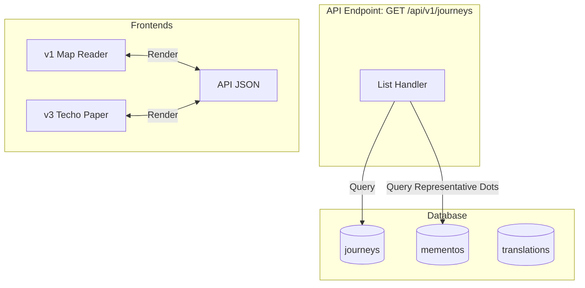

# Revision of the Backend Plan — felicia

This document reviews and refines the backend plan for **felicia**, a map-based travel journal. It reconciles current design drafts ([`backend-stack.md`](file:///home/haru/Projects/project-github/felicia/docs/research/backend-stack.md), [`data-model.md`](file:///home/haru/Projects/project-github/felicia/docs/research/data-model.md), and [`memento-templates.md`](file:///home/haru/Projects/project-github/felicia/docs/research/memento-templates.md)) with the Svelte demo UI, UX flows (including the Techo Paper v3 landing), and data ingestion realities.

---

## 1. Data Model Review & Refinements

The database schema must be **presentation-agnostic** while remaining robust under repetitive data updates.

### A. Translation Sidecar & Path Merging
Primary language content (`ja`) lives inline on tables like `mementos`. Non-primary languages (`en`, `zh`) live in `translations`.

```sql
CREATE TABLE translations (
    id UUID PRIMARY KEY DEFAULT gen_random_uuid(),
    owner_type TEXT NOT NULL,          -- 'journey', 'memento', 'photo'
    owner_id UUID NOT NULL,
    lang TEXT NOT NULL,                -- 'en', 'zh'
    field TEXT NOT NULL,               -- e.g., 'title', 'kind_data.operator', 'kind_data.from.name'
    value TEXT NOT NULL,
    provenance TEXT NOT NULL,          -- 'machine', 'authored'
    updated_at TIMESTAMPTZ NOT NULL DEFAULT NOW(),
    CONSTRAINT unique_translation UNIQUE (owner_type, owner_id, lang, field)
);
```

#### The Translatable Path Merge Challenge
For simple fields like `title`, the merge is direct. User-authored essays (like `essay` and photo captions) are **not** translated and remain solely in the primary Japanese language. For JSONB columns like `kind_data` (e.g. transit's `{ "operator": "JR East", "line": "Yamanote Line" }`), the merge requires traversing paths:
- If a translation exists for `owner_type='memento'`, `field='kind_data.operator'`, the backend must replace/insert this translated string into the `kind_data` JSON payload before serving the API.
- **Go Implementation Rule:** The API handler utilizes a JSON path-traversal resolver to dynamically patch the serialized `kind_data` map with translated values before encoding the response.

### B. Spatial Snapping & The Dwell-Time Gap
Point mementos snap to the nearest **Dawarich visit**. But if a photo is taken at a remote rest stop or in-transit where Dawarich registered no "visit":
- **Constraint:** Hard snapping to the nearest spatial visit without checking temporal proximity leads to incorrect locations (e.g., photo taken on a train snapped to a station visited 2 hours later).
- **Refinement:** Snapping uses a double-gated threshold:
  1. **Temporal Match:** If the photo's timestamp falls within the `[arrive, depart]` window of a visit, snap to that visit.
  2. **Spatial fallback:** If no visit overlaps temporally, find the nearest visit within a $500\text{m}$ radius. If no visit is found, fallback to the photo's raw EXIF coordinates and label the place as a standalone coord (e.g. `"Coords: Lat, Lng"`), treating it as a transient visit.
  3. **Coords-Less Timezone Fallback:** If a photo has no EXIF coordinates and no matching visit, its timezone (`occurred_tz`) falls back to the default timezone defined at the Journey level (e.g. `Asia/Tokyo`).

### C. Geometry SRID
All spatial data operates strictly on **SRID 4326** (WGS 84), handled via PostGIS geometry columns:
- `journeys.gps_route`: `geometry(MultiLineString, 4326)`
- `mementos.geom`: `geometry(Geometry, 4326)` — Point or LineString

### D. PostgreSQL 18 Modern Feature Exploitation
By using **PostgreSQL 18** as our database foundation, we leverage modern, stable, and standards-compliant relational features to simplify application logic and optimize performance:

1. **SQL/JSON Standard Functions:**
   * Instead of relying on PG-specific legacy JSON operators (`#>`, `->>`), queries on `mementos.kind_data` utilize standard SQL/JSON functions (`JSON_VALUE`, `JSON_QUERY`, `JSON_EXISTS`). This aligns our schema queries with standard SQL and improves query planner optimization.
   * Example query for transit mementos:
     ```sql
     SELECT id, JSON_VALUE(kind_data, '$.operator' RETURNING text) AS operator 
     FROM mementos 
     WHERE JSON_EXISTS(kind_data, '$.operator');
     ```

2. **Advanced MERGE for Field-Scoped Upserts:**
   * PostgreSQL 18's enhanced `MERGE` statement executes complex conditional upserts (our multi-axis "no-clobber" rule) in a single database transaction:
     ```sql
     MERGE INTO mementos AS target
     USING (VALUES ($1, $2, $3, $4, $5)) AS source(journey_id, source_ref, kind, geom, occurred_at)
     ON target.journey_id = source.journey_id AND target.source_ref = source.source_ref
     WHEN MATCHED AND NOT (target.authored_fields @> ARRAY['occurred_at']) THEN
         UPDATE SET occurred_at = source.occurred_at, geom = source.geom, updated_at = NOW()
     WHEN NOT MATCHED THEN
         INSERT (journey_id, source_ref, kind, geom, occurred_at) 
         VALUES (source.journey_id, source.source_ref, source.kind, source.geom, source.occurred_at);
     ```
   * This guarantees atomic updates and eliminates check-then-write roundtrips in Go application logic.

3. **Sequential UUIDv7 Keys:**
   * Native PostgreSQL 18 supports highly-optimized sequential UUIDv7 generation for primary keys (e.g. `translations`, `mementos`). This provides natural chronological ordering for free and prevents B-Tree index fragmentation common to random UUIDv4.

4. **PostGIS Parallel Index Scanning:**
   * PostGIS queries (such as route aggregation via `ST_Collect` and spatial proximity snapping) take full advantage of PostgreSQL 18's multi-worker parallel execution plans over GIST indexes.

---

## 2. UX & Frontend Interface Integration

The backend is built around the **Presentation-Agnostic Contract**: the database and API do not store layout/view states. However, the API must be optimized for different UI views.



### A. Landing Index Optimization (No N+1)
The v3 Techo landing page renders a map with representative place dots per journey and a card index. To avoid N+1 queries:
- `GET /api/v1/journeys` returns a collection of journeys, where each item includes:
  ```json
  {
    "slug": "2026-japan-spring",
    "title": "日本春旅",
    "memento_count": 14,
    "representative_dots": [
      { "coord": [139.76, 35.68], "label": "東京駅" },
      { "coord": [135.50, 34.69], "label": "大阪" }
    ]
  }
  ```
- **Selection Heuristic:** The database derives these representative dots at query time by selecting up to 3 mementos per journey, ordered by:
  1. The chronological order (`occurred_at ASC`).
  2. Prioritizing distinct places over adjacent points.

### B. Language Fallbacks
If a user requests the English (`en`) interface:
1. Return translation values where they exist.
2. If `en` is missing, fall back to Japanese (`ja`), which is the canonical inline value.
3. The API includes a header or payload key indicating the target locale and if fallbacks occurred.

---

## 3. Ingestion & Invariant Workflows

The **A+E model** coordinates automated ingestion (**A**) with manual authoring (**E**).

```
[Immich API] ──> Fetch Photo ──> Resize & Strip EXIF ──> Hash Derivative ──> Deduplicate R2
                                                                         └─> Seed Memento (DB)
```

### A. Zero-Diff Idempotency
To prevent duplicate storage and database noise on repeated imports:
1. **Hash derivative first:** The importer fetches the original photo, resizes it, and strips EXIF tags.
2. **Calculate SHA-256:** It hashes the *resulting derivative bytes*, producing a unique `content_hash`.
3. **Deduplicate:**
   - Query `memento_photos` for the `content_hash`.
   - If it exists, link the new memento to the existing `object_key` and skip the R2 upload.
   - If it does not exist, upload to R2 and insert a new photo record.

### B. The Multi-Axis "No-Clobber" Rule
When the importer runs, it must never overwrite human-authored data.
- **Fields (Field-Scoped):** If a field name is present in `authored_fields` (e.g. `['title', 'place']`), the importer skips updates to that field.
- **Translations (Language-Scoped):**
  - If `translations.provenance = 'machine'`, the importer is permitted to overwrite it (e.g. if the original Japanese text changed).
  - If `translations.provenance = 'authored'`, the importer must preserve the text, even if the primary source text has updated.

---

## 4. Future plans & Scaling Seams

### A. Sharing & Visibility (Viewer Tier)
To pivot from single-user to private sharing without building a heavy auth/membership system:
- Add a `visibility` column to `journeys`: `private | shared | public`.
- **Shared Access:** Introduce a `share_token` (cryptographic random string) on journeys. Anyone accessing `/api/v1/journeys/{slug}?token={share_token}` can read the journey and its mementos even if they are marked `shared`.
- Public endpoints return only `public` visibility records. Admin endpoints return all visibility states.

### B. Schema Versioning for Templates
If a kind template definition (e.g. `transit.yaml`) changes over time:
- The template YAML registry includes a `version` field (e.g. `version: 2`).
- Saved mementos record `kind_version` in their schema.
- If a schema mismatch is detected during load, the Go backend applies dynamic resolvers or triggers a database migration to reconcile the `kind_data` JSONB structure.

### C. PostgreSQL 18 & Static-Site Generation (SSG) Model (with SQLite3 Fallback)
To support a single-user publishing model (similar to `yihong0618/running_page`), `felicia` operates as a compiler that reads from our primary **PostgreSQL 18 + PostGIS** database (or an offline **SQLite3** fallback database) to generate a zero-cost, 100% static public website.

```
+------------------+                   +--------------------+                   +----------------------+
| Local Authoring  |                   | Primary PG18 DB    |                   |   Static Site Build  |
| (Go localhost    | ==[Writes to]==>  | (PostGIS checks)   | ==[Compiles to]==> | (Static JSONs +      |
|  admin interface)|                   | [SQLite3 Fallback] |                   |  EXIF-stripped media)|
+------------------+                   +--------------------+                   +----------------------+
                                                                                           ||
                                                                                   [Deploys for free to]
                                                                                           ||
                                                                                           \/
                                                                                +----------------------+
                                                                                | Cloudflare / GitHub  |
                                                                                |  Pages (Anon Reader) |
                                                                                +----------------------+
```

1. **Primary Database & Offline SQLite3 Fallback:**
   * PostgreSQL 18 + PostGIS is the primary, production-ready storage engine.
   * For offline compilation or local development, SQLite3 is supported as an offline fallback (using a pure-Go, CGO-free driver such as `ncruces/go-sqlite3`).
   * Geometry processing (such as Douglas–Peucker simplification and spatial snapping to visits) in SQLite3 mode is computed in Go memory via the `paulmach/orb` library, writing standard WKB blobs to SQLite3 and eliminating system-level SpatiaLite dependencies.

2. **Local Admin UI (`localhost`):**
   * The user runs a command (`felicia admin`) locally to start a lightweight web server on their machine.
   * They use the admin UI (`web/admin`) locally to edit essays, structure transit legs, and arrange photos.

3. **Static Build Output (`felicia build`):**
   * The compiler queries the local SQLite file and outputs the entire public website into a static directory:
     * Generates static JSON files representing the API tree (e.g., `/api/v1/journeys.json`, `/api/v1/journeys/<slug>.json`, `/api/v1/mementos.json`). The frontend fetches these static paths directly.
     * Moves resized and EXIF-stripped image derivatives to `images/<content_hash>.jpg`.
     * Emits the Svelte SPA production bundle.

4. **GitHub Actions / Cron Automation:**
   * Users can automate ingestion via GitHub Actions or local crons. A daily workflow triggers the Go CLI to pull GPX/visits from Dawarich and media from Immich, merges them, builds the static build directory, and deploys it to Cloudflare Pages or GitHub Pages for free.

---

## 5. Backup & Disaster Recovery Plan

> [!WARNING]
> The database is **not** a rebuildable projection from scratch. While GPS tracks and photos are cached in Dawarich/Immich/R2, all authored essays, curated gallery sequences, manually created transit legs, and hand-corrected translations reside **exclusively** in the Postgres database.

### A. Authored State Backup (Git Invariant)
To protect authored data against database corruption, the system runs a daily cron that:
1. Dumps the Postgres database.
2. Extracts all `AUTHORED` fields (essays, titles, translations with `provenance='authored'`) into flat YAML files.
3. Commits and pushes these flat files to a private Git backup repository.
4. **Restore Workflow:** If the database is lost, the importer imports the media from Immich/Dawarich, and then applies the Git-serialized YAML overrides to restore the authored text.

### B. Ingest Offlining Fallbacks
If Immich or Dawarich API endpoints are offline:
- **GPX Fallback:** The CLI importer accepts local `.gpx` or `.geojson` track files via command-line flags. It applies the same Douglas–Peucker simplification and gap-splitting logic.
- **Local Directory Fallback:** Photos can be imported from a local folder structure (e.g., `import/photos/*.jpg`). EXIF extraction, resizing, and R2 uploads run normally, using file creation dates as temporal anchors.
