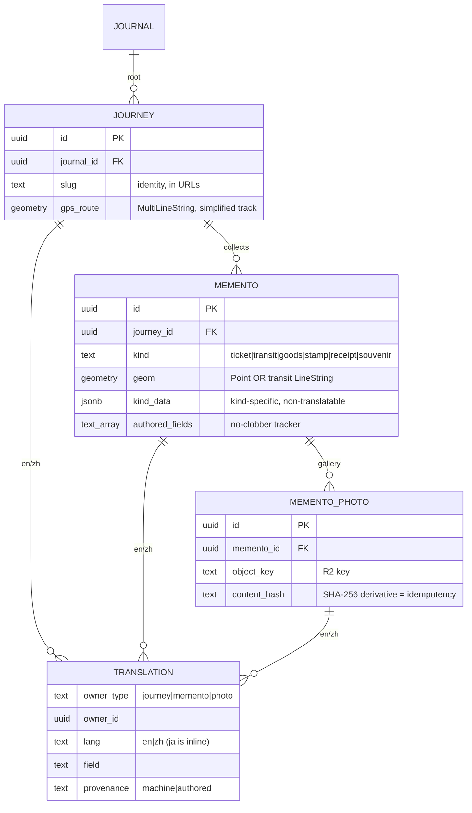
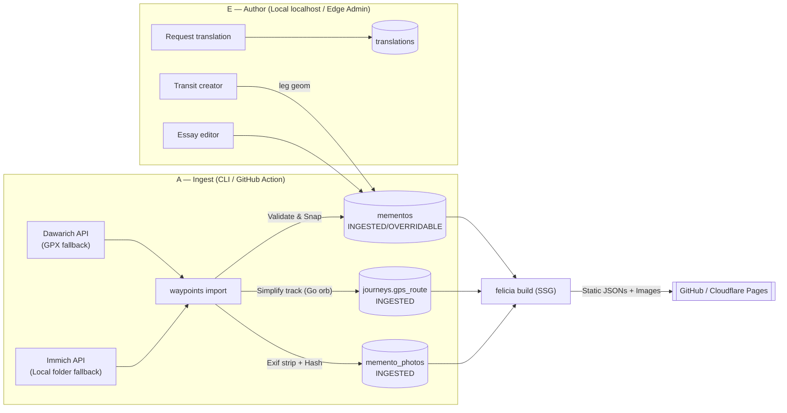

# Research — the stable data model (memento-era schema)

> 2026-07-09. The **stable** backend schema — designed once, meant not to be rebuilt from
> zero. Derives from the decisions in [`backend-stack.md`](backend-stack.md) (D1–D8), the plan revision in [`backend-plan-revision.md`](backend-plan-revision.md), and
> supersedes the ticket-era ER in [`archive/design.md`](../archive/design.md) §4. 
> It provides DDL schemas for both **PostgreSQL 18** (for server mode) and **SQLite** (for local-first, CGO-free compiler mode).

## Design invariants (why this is stable)

1. **Presentation-agnostic** — no view-specific columns (no `is_landing`, `carousel_index`).
   Every frontend is a projection; the DB blesses only semantic order (`occurred_at`, `seq`,
   `kind`). (`felicia:decision:presentation-agnostic-contract`)
2. **Single journal root** — everything hangs off one `journal` row even though there is
   exactly one. Multi-tenant later = "add rows + a filter," not "reshape every table."
   (direction.md hedge #3)
3. **Dual Engine Support (PG18 & SQLite)** — unified table schemas matching 1:1 in Go models, with
   platform-specific differences (PostGIS vs. WKB BLOB, JSONB vs. JSON Text) handled at the repository implementation seam.
4. **Provenance is load-bearing** — every writable field is INGESTED / OVERRIDABLE / AUTHORED,
   and translations add a **language axis**; the importer never clobbers authored work.
5. **Uniform memento** — one `mementos` table, `kind`-tagged, kind-specifics in `kind_data`
   jsonb/json. New kinds = new enum value, not new tables.

## The shape at a glance



---

## Database Schemas (DDL)

### 1. PostgreSQL 18 Schema (Server Mode)

Leverages native spatial features (PostGIS), standard SQL/JSON querying, sequential UUIDv7 generation, and advanced MERGE actions.

```sql
-- Enable PostGIS extension
CREATE EXTENSION IF NOT EXISTS postgis;

CREATE TABLE journal (
    id UUID PRIMARY KEY DEFAULT gen_random_uuid(), -- Handled as UUIDv7 generated in Go or DB-default
    created_at TIMESTAMPTZ NOT NULL DEFAULT NOW()
);

CREATE TABLE journeys (
    id UUID PRIMARY KEY DEFAULT gen_random_uuid(),
    journal_id UUID NOT NULL REFERENCES journal(id) ON DELETE CASCADE,
    slug TEXT NOT NULL UNIQUE,
    source_ref TEXT,
    title TEXT NOT NULL, -- Canonical Japanese (ja)
    place TEXT NOT NULL,
    country VARCHAR(3),
    region TEXT,
    date_start DATE NOT NULL,
    date_end DATE NOT NULL,
    gps_route GEOMETRY(MultiLineString, 4326),
    authored_fields TEXT[] NOT NULL DEFAULT '{}',
    created_at TIMESTAMPTZ NOT NULL DEFAULT NOW(),
    updated_at TIMESTAMPTZ NOT NULL DEFAULT NOW(),
    CONSTRAINT unique_journal_source UNIQUE (journal_id, source_ref)
);

CREATE TABLE mementos (
    id UUID PRIMARY KEY DEFAULT gen_random_uuid(),
    journey_id UUID NOT NULL REFERENCES journeys(id) ON DELETE CASCADE,
    kind TEXT NOT NULL,
    seq INT NOT NULL,
    occurred_at TIMESTAMPTZ NOT NULL,
    occurred_tz TEXT NOT NULL,
    geom GEOMETRY(Geometry, 4326) NOT NULL,
    title TEXT NOT NULL, -- Canonical Japanese (ja)
    place TEXT NOT NULL,
    vendor TEXT,
    essay TEXT,
    price_amount BIGINT,
    price_currency CHAR(3),
    kind_data JSONB NOT NULL DEFAULT '{}',
    source_ref TEXT,
    authored_fields TEXT[] NOT NULL DEFAULT '{}',
    orphaned_at TIMESTAMPTZ,
    created_at TIMESTAMPTZ NOT NULL DEFAULT NOW(),
    updated_at TIMESTAMPTZ NOT NULL DEFAULT NOW(),
    CONSTRAINT unique_journey_source_memento UNIQUE (journey_id, source_ref),
    CONSTRAINT valid_currency CHECK (price_currency IS NULL OR price_currency ~ '^[A-Z]{3}$')
);

CREATE TABLE translations (
    id UUID PRIMARY KEY DEFAULT gen_random_uuid(),
    owner_type TEXT NOT NULL CHECK (owner_type IN ('journey', 'memento', 'photo')),
    owner_id UUID NOT NULL,
    lang TEXT NOT NULL CHECK (lang IN ('en', 'zh')),
    field TEXT NOT NULL,
    value TEXT NOT NULL,
    provenance TEXT NOT NULL CHECK (provenance IN ('machine', 'authored')),
    updated_at TIMESTAMPTZ NOT NULL DEFAULT NOW(),
    CONSTRAINT unique_translation UNIQUE (owner_type, owner_id, lang, field)
);

CREATE TABLE memento_photos (
    id UUID PRIMARY KEY DEFAULT gen_random_uuid(),
    memento_id UUID NOT NULL REFERENCES mementos(id) ON DELETE CASCADE,
    object_key TEXT NOT NULL,
    content_hash TEXT NOT NULL,
    caption TEXT, -- Canonical Japanese (ja)
    seq INT NOT NULL DEFAULT 0,
    taken_at TIMESTAMPTZ,
    source_ref TEXT,
    created_at TIMESTAMPTZ NOT NULL DEFAULT NOW(),
    CONSTRAINT unique_memento_source_photo UNIQUE (memento_id, source_ref),
    CONSTRAINT unique_memento_photo_hash UNIQUE (memento_id, content_hash)
);

-- Indexes
CREATE INDEX idx_journeys_gps_route ON journeys USING GIST(gps_route);
CREATE INDEX idx_mementos_geom ON mementos USING GIST(geom);
CREATE INDEX idx_mementos_journey_seq ON mementos(journey_id, seq);
CREATE INDEX idx_mementos_kind ON mementos(kind);
CREATE INDEX idx_mementos_occurred ON mementos(occurred_at DESC);
CREATE INDEX idx_memento_photos_memento_seq ON memento_photos(memento_id, seq);
```

### 2. SQLite Schema (Local-First Compiler Mode)

Uses text UUIDs, standard JSON strings for nested properties, standard text JSON arrays for `authored_fields`, and WKB (Well-Known Binary) BLOBs for spatial data (retaining full CGO-free portability).

```sql
CREATE TABLE journal (
    id TEXT PRIMARY KEY, -- UUID string
    created_at DATETIME NOT NULL DEFAULT CURRENT_TIMESTAMP
);

CREATE TABLE journeys (
    id TEXT PRIMARY KEY,
    journal_id TEXT NOT NULL REFERENCES journal(id) ON DELETE CASCADE,
    slug TEXT NOT NULL UNIQUE,
    source_ref TEXT,
    title TEXT NOT NULL,
    place TEXT NOT NULL,
    country TEXT,
    region TEXT,
    date_start TEXT NOT NULL,
    date_end TEXT NOT NULL,
    gps_route BLOB, -- WKB MultiLineString
    authored_fields TEXT NOT NULL DEFAULT '[]', -- JSON array of strings
    created_at DATETIME NOT NULL DEFAULT CURRENT_TIMESTAMP,
    updated_at DATETIME NOT NULL DEFAULT CURRENT_TIMESTAMP,
    UNIQUE(journal_id, source_ref)
);

CREATE TABLE mementos (
    id TEXT PRIMARY KEY,
    journey_id TEXT NOT NULL REFERENCES journeys(id) ON DELETE CASCADE,
    kind TEXT NOT NULL,
    seq INTEGER NOT NULL,
    occurred_at TEXT NOT NULL,
    occurred_tz TEXT NOT NULL,
    geom BLOB NOT NULL, -- WKB Point or LineString
    title TEXT NOT NULL,
    place TEXT NOT NULL,
    vendor TEXT,
    essay TEXT,
    price_amount INTEGER,
    price_currency TEXT,
    kind_data TEXT NOT NULL DEFAULT '{}', -- JSON text
    source_ref TEXT,
    authored_fields TEXT NOT NULL DEFAULT '[]', -- JSON array of strings
    orphaned_at TEXT,
    created_at DATETIME NOT NULL DEFAULT CURRENT_TIMESTAMP,
    updated_at DATETIME NOT NULL DEFAULT CURRENT_TIMESTAMP,
    UNIQUE(journey_id, source_ref)
);

CREATE TABLE translations (
    id TEXT PRIMARY KEY,
    owner_type TEXT NOT NULL CHECK (owner_type IN ('journey', 'memento', 'photo')),
    owner_id TEXT NOT NULL,
    lang TEXT NOT NULL CHECK (lang IN ('en', 'zh')),
    field TEXT NOT NULL,
    value TEXT NOT NULL,
    provenance TEXT NOT NULL CHECK (provenance IN ('machine', 'authored')),
    updated_at DATETIME NOT NULL DEFAULT CURRENT_TIMESTAMP,
    UNIQUE(owner_type, owner_id, lang, field)
);

CREATE TABLE memento_photos (
    id TEXT PRIMARY KEY,
    memento_id TEXT NOT NULL REFERENCES mementos(id) ON DELETE CASCADE,
    object_key TEXT NOT NULL,
    content_hash TEXT NOT NULL,
    caption TEXT,
    seq INTEGER NOT NULL DEFAULT 0,
    taken_at TEXT,
    source_ref TEXT,
    created_at DATETIME NOT NULL DEFAULT CURRENT_TIMESTAMP,
    UNIQUE(memento_id, source_ref),
    UNIQUE(memento_id, content_hash)
);

-- Indexes
CREATE INDEX idx_mementos_journey_seq ON mementos(journey_id, seq);
CREATE INDEX idx_mementos_kind ON mementos(kind);
CREATE INDEX idx_mementos_occurred ON mementos(occurred_at);
CREATE INDEX idx_memento_photos_memento_seq ON memento_photos(memento_id, seq);
```

---

## Entity Details & Field Mapping

### `journal` — the root (one row)

| Column | PG Type | SQLite Type | Notes |
| --- | --- | --- | --- |
| `id` | `uuid pk` | `TEXT pk` | the single root; FKs hang off it |
| `created_at` | `timestamptz` | `TEXT` | |

### `journeys`

| Column | PG Type | SQLite Type | Class | Notes |
| --- | --- | --- | --- | --- |
| `id` | `uuid pk` | `TEXT pk` | — | |
| `journal_id` | `uuid` | `TEXT` | — | references `journal.id` |
| `slug` | `text` | `TEXT` | identity | `<yyyy>-<mm>-<slugify(name)>` (computed once, in URLs) |
| `source_ref` | `text` | `TEXT` | INGESTED | e.g. `immich-album:<uuid>` |
| `title` | `text` | `TEXT` | AUTHORED | primary-lang (ja); en/zh in `translations` |
| `place` | `text` | `TEXT` | OVERRIDABLE | primary-lang summary of the region |
| `country` | `varchar(3)` | `TEXT` | OVERRIDABLE | ISO country code |
| `region` | `text` | `TEXT` | OVERRIDABLE | |
| `date_start` | `date` | `TEXT` | OVERRIDABLE | min asset capture date |
| `date_end` | `date` | `TEXT` | OVERRIDABLE | max asset capture date |
| `gps_route` | `geometry` | `BLOB` | INGESTED | simplified passive track |
| `authored_fields` | `text[]` | `TEXT` | — | no-clobber tracker (SQLite holds as JSON array) |

### `mementos`

| Column | PG Type | SQLite Type | Class | Notes |
| --- | --- | --- | --- | --- |
| `id` | `uuid pk` | `TEXT pk` | — | |
| `journey_id` | `uuid` | `TEXT` | — | references `journeys.id` |
| `kind` | `text` | `TEXT` | OVERRIDABLE | enum: `ticket \| transit \| goods \| stamp \| receipt \| souvenir` |
| `seq` | `int` | `INTEGER` | OVERRIDABLE | chronological default sequence |
| `occurred_at` | `timestamptz` | `TEXT` | OVERRIDABLE | resolved timestamp |
| `occurred_tz` | `text` | `TEXT` | OVERRIDABLE | IANA tz identifier |
| `geom` | `geometry` | `BLOB` | INGESTED¹ | Point (goods/stamp) or LineString (transit) |
| `title` | `text` | `TEXT` | AUTHORED | primary-lang (ja) |
| `place` | `text` | `TEXT` | OVERRIDABLE | primary-lang |
| `vendor` | `text` | `TEXT` | OVERRIDABLE | |
| `essay` | `text` | `TEXT` | AUTHORED | primary-lang markdown |
| `price_amount` | `bigint` | `INTEGER` | OVERRIDABLE | minor units (¥210 → 210) |
| `price_currency`| `char(3)` | `TEXT` | OVERRIDABLE | ISO 4217 currency code |
| `kind_data` | `jsonb` | `TEXT` | mixed² | kind-specific properties (transit stations, operator) |
| `source_ref` | `text` | `TEXT` | INGESTED | immich or file reference |
| `authored_fields` | `text[]` | `TEXT` | — | no-clobber tracker |
| `orphaned_at` | `timestamptz` | `TEXT` | INGESTED | marked when source asset disappears |

---

## Places — a *derived visit* layer (not a stored table)

Two frontends group mementos by **place** — the techo landing's city dots and the
detail's "several memories at one place" — yet there is deliberately **no `places` table**. A
place is a **derived visit**, computed the way Dawarich and Google Timeline both do it: a *stay*,
detected by dwell-time + spatial clustering over the track, reverse-geocoded to a name.

- **Source of truth.** Dawarich already runs this pipeline (`points → tracks → visits @ places →
  trips`). When the track is Dawarich's, **consume its `visits`/`places`** rather than
  re-deriving. For a plain GPX import (no Dawarich)
  a dwell-time clustering fallback produces the same `Visit` shape **at the edge** — the core
  stays generic over the normalized shape.
- **A memento anchors to a visit, not a bare point.** Its point `geom` snaps to the nearest
  **visit** (within temporal overlap or a spatial threshold of 500m/30min), inheriting its place name and coord.
- **A projection, not schema.** Per journey the API serves an ordered
  `places[] = { key, label (i18n), coord, seq, memento_count }`, keyed by **snapped coordinate**.

---

## Provenance map (three classes × language)

| Class | Importer | Admin | Fields |
| --- | --- | --- | --- |
| **INGESTED** | always writes | read-only | `source_ref`, `gps_route`, point `geom`, `object_key`, `content_hash`, `taken_at`, `orphaned_at` |
| **OVERRIDABLE** | writes **until** the field name is in `authored_fields` | editable | `kind`, `occurred_at`, `occurred_tz`, `place`, `vendor`, `price_*`, `seq`, journey `country/region/date_*` |
| **AUTHORED** | never writes | owns | `title`, `essay`, `caption`, photo selection/order, transit-leg `geom`, en/zh `translations(authored)` |

### Upsert and Translation Merge Rules

1. **Upserts:** In PG 18, conditional MERGE statement writes to target variables if and only if the updated fields are absent from `authored_fields`. In SQLite, the Go layer handles JSON parsing of `authored_fields` before issuing an UPDATE.
2. **Translation Merge:** For translatable fields inside JSON (`kind_data.operator`), the API layer dynamically reads the sidecar `translations` table and merges matching values into the output JSON payload based on the requested locale.

---

## Workflow — how data moves through the schema


