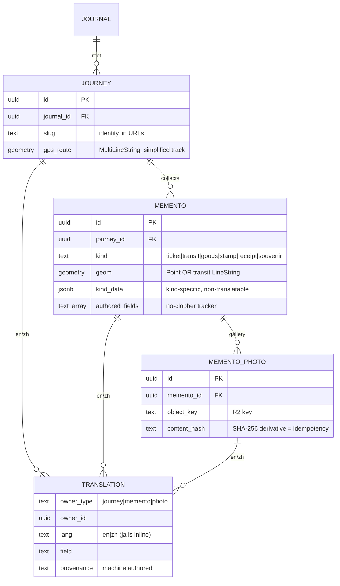
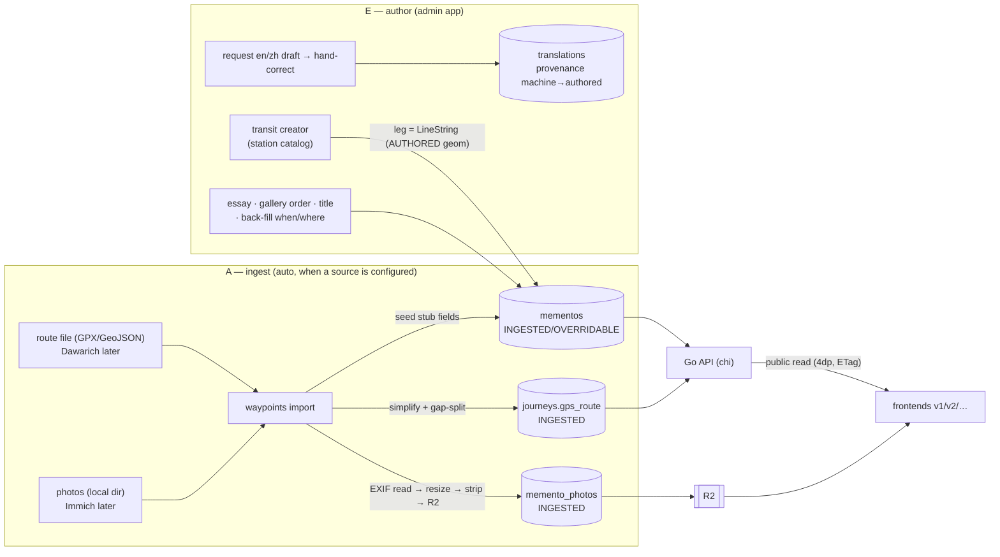

# Research — the stable data model (memento-era schema)

> 2026-07-08. The **stable** backend schema — designed once, meant not to be rebuilt from
> zero. Derives from the decisions in [`backend-stack.md`](backend-stack.md) (D1–D8) and
> supersedes the ticket-era ER in [`archive/design.md`](../archive/design.md) §4. Postgres +
> PostGIS; migrated with goose. Research-stage draft that promotes to `docs/spec/data-model.md`
> when ratified. Types shown are the intended DDL; a goose migration is the S-phase artifact.

## Design invariants (why this is stable)

1. **Presentation-agnostic** — no view-specific columns (no `is_landing`, `carousel_index`).
   Every frontend is a projection; the DB blesses only semantic order (`occurred_at`, `seq`,
   `kind`). (`felicia:decision:presentation-agnostic-contract`)
2. **Single journal root** — everything hangs off one `journal` row even though there is
   exactly one. Multi-tenant later = "add rows + a filter," not "reshape every table."
   (direction.md hedge #3)
3. **DB is a rebuildable projection** — raw GPS track and original photos are **not** stored;
   only derived geometry + EXIF-stripped derivatives. Lose the host → restore DB → re-import.
4. **Provenance is load-bearing** — every writable field is INGESTED / OVERRIDABLE / AUTHORED,
   and translations add a **language axis**; the importer never clobbers authored work.
5. **Uniform memento** — one `mementos` table, `kind`-tagged, kind-specifics in `kind_data`
   jsonb. New kinds = new enum value, not new tables.

## The shape at a glance

## Entities

### `journal` — the root (one row)

| Column | Type | Notes |
| --- | --- | --- |
| `id` | `uuid pk` | the single root; FKs hang off it |
| `created_at` | `timestamptz` | |

Product-ready seam: `owner_id`, `title` etc. arrive here later; nothing else reshapes.

### `journeys`

| Column | Type | Class | Notes |
| --- | --- | --- | --- |
| `id` | `uuid pk` | — | |
| `journal_id` | `uuid → journal` | — | the root FK |
| `slug` | `text` | identity | `<yyyy>-<mm>-<slugify(name)>`, computed **once**, in URLs (archive A2) |
| `source_ref` | `text null` | INGESTED | e.g. `immich-album:<uuid>`; survives album rename |
| `title` | `text` | AUTHORED | primary-lang (ja); en/zh in `translations` |
| `place` | `text` | OVERRIDABLE | primary-lang summary of the region |
| `country` | `text null` | OVERRIDABLE | ISO code |
| `region` | `text null` | OVERRIDABLE | |
| `date_start` | `date` | OVERRIDABLE | min asset capture date at first import |
| `date_end` | `date` | OVERRIDABLE | max asset capture date |
| `gps_route` | `geometry(MultiLineString,4326) null` | INGESTED | simplified passive track (D–P, gap-split, archive B2). NULL if no track source. **Not** the raw points. |
| `authored_fields` | `text[] not null '{}'` | — | no-clobber tracker |
| `created_at` / `updated_at` | `timestamptz` | — | |

> **Display route = `gps_route` ∪ transit-leg geoms**, composed at **query time** with
> `ST_Collect` (D2). Not materialized — so adding a transit memento needs no cache
> invalidation. Segment order is cosmetic for rendering; timestamp-interleave only matters if
> a single ordered path is ever needed.

### `mementos`

| Column | Type | Class | Notes |
| --- | --- | --- | --- |
| `id` | `uuid pk` | — | |
| `journey_id` | `uuid → journeys` | — | |
| `kind` | `text` | OVERRIDABLE | enum: `ticket \| transit \| goods \| stamp \| receipt \| souvenir` (D8) |
| `seq` | `int` | OVERRIDABLE | chronological default; admin may reorder |
| `occurred_at` | `timestamptz` | OVERRIDABLE | resolved instant (OCR>EXIF>snap, archive A4) |
| `occurred_tz` | `text` | OVERRIDABLE | IANA tz id, so the client renders local wall-clock |
| `geom` | `geometry(Geometry,4326)` | INGESTED¹ | **Point** (goods/stamp/ticket, route-snap) or **LineString** (transit leg). ¹transit-leg geom is AUTHORED (created in the transit form). |
| `title` | `text` | AUTHORED | primary-lang (ja) |
| `place` | `text` | OVERRIDABLE | primary-lang |
| `vendor` | `text null` | OVERRIDABLE | primary-lang |
| `essay` | `text null` | AUTHORED | primary-lang, markdown |
| `price_amount` | `bigint null` | OVERRIDABLE | **minor units** (¥210 → 210; $4.50 → 450) |
| `price_currency` | `char(3) null` | OVERRIDABLE | ISO 4217 |
| `kind_data` | `jsonb not null '{}'` | mixed² | kind-specific, non-translatable: transit `{operator, line, from:{name,coords}, to:{name,coords}, fare}`. ²translatable sub-fields (operator/line/station names) live in `translations` keyed `kind_data.operator` etc.; coords/fare stay here. |
| `source_ref` | `text null` | INGESTED | `immich:<asset-uuid>` \| `file:...` |
| `authored_fields` | `text[] not null '{}'` | — | no-clobber tracker |
| `orphaned_at` | `timestamptz null` | INGESTED | set when source album drops `source_ref`; never auto-deleted (archive C3) |
| `created_at` / `updated_at` | `timestamptz` | — | |

### `translations` — i18n sidecar (non-primary locales only)

Primary language (**ja**) lives inline on the entity; `en`/`zh` live here — so the default
JP render never joins, and each non-primary field carries its own provenance.

| Column | Type | Notes |
| --- | --- | --- |
| `owner_type` | `text` | `journey \| memento \| photo` |
| `owner_id` | `uuid` | |
| `lang` | `text` | `en \| zh` (never `ja` — that's inline) |
| `field` | `text` | `title \| place \| vendor \| essay \| caption \| kind_data.operator \| kind_data.line \| kind_data.from.name \| kind_data.to.name` |
| `value` | `text` | |
| `provenance` | `text` | `machine \| authored` — **the language axis of no-clobber** |
| `updated_at` | `timestamptz` | |

Rule: a re-translate pass writes a row **only if it's absent or `provenance='machine'`** —
a hand-corrected (`authored`) locale is never overwritten. Missing row → client falls back
to the inline `ja` value.

### `memento_photos` — the gallery

| Column | Type | Class | Notes |
| --- | --- | --- | --- |
| `id` | `uuid pk` | — | |
| `memento_id` | `uuid → mementos` | — | |
| `object_key` | `text` | INGESTED | `journeys/<slug>/<kind>/<hash>.jpg` (archive C5) |
| `content_hash` | `text` | INGESTED | SHA-256 of **derivative** bytes → idempotency + dedup |
| `caption` | `text null` | AUTHORED | primary-lang; en/zh in `translations` (`owner_type=photo`) |
| `seq` | `int` | AUTHORED | curated order |
| `taken_at` | `timestamptz null` | INGESTED | |
| `source_ref` | `text null` | INGESTED | immich asset id |
| `created_at` | `timestamptz` | — | |

## Provenance map (three classes × language)

| Class | Importer | Admin | Fields |
| --- | --- | --- | --- |
| **INGESTED** | always writes | read-only | `source_ref`, `gps_route`, point `geom`, `object_key`, `content_hash`, `taken_at`, `orphaned_at` |
| **OVERRIDABLE** | writes **until** the field name is in `authored_fields` | editable | `kind`, `occurred_at`, `occurred_tz`, `place`, `vendor`, `price_*`, `seq`, journey `country/region/date_*` |
| **AUTHORED** | never writes (absent from Patch types) | owns | `title`, `essay`, `caption`, photo selection/order, transit-leg `geom`, en/zh `translations(authored)` |

Mechanism (archive B1): the admin API appends a column name to `authored_fields` on human
edit; the repository filters incoming patches so an OVERRIDABLE field is skipped when its
name is present. AUTHORED fields are structurally absent from Patch types. The **language
axis** rides on `translations.provenance`.

## Indexes & upsert targets

| Table | Unique / index | Purpose |
| --- | --- | --- |
| `journeys` | `unique(slug)`, `unique(journal_id, source_ref)` | identity + re-import match |
| `journeys` | `gist(gps_route)` | spatial |
| `mementos` | `unique(journey_id, source_ref) where source_ref not null` | re-import upsert (archive C1) |
| `mementos` | `index(journey_id, seq)`, `index(kind)`, `index(occurred_at desc)` | rail order, by-kind + flat `/api/mementos` sort (D5) |
| `mementos` | `gist(geom)` | spatial |
| `translations` | `unique(owner_type, owner_id, lang, field)` | one value per locale-field |
| `memento_photos` | `unique(memento_id, source_ref)`, `unique(memento_id, content_hash)` | dedup + idempotency (archive C2) |
| `memento_photos` | `index(memento_id, seq)` | gallery order |

Upserts use `ON CONFLICT ... DO UPDATE` with the `authored_fields` filter; idempotency test:
second import on identical fixtures → **0** row writes, **0** object puts.

## Workflow — how data moves through the schema

Two writers, one canonical DB (the **A+E** model, memento-era). Re-running **A** is always
safe because the importer is field-scoped.

**A — ingest (no toil).** `waypoints import` pulls a **route** (a per-trip GPX/GeoJSON file
now; Dawarich API later) → Douglas–Peucker + gap-split → `journeys.gps_route`; and **photos**
(a local dir now; Immich later) → EXIF lat/lng/time → resize + EXIF-strip → R2 →
`memento_photos`, seeding stub mementos. **No OCR** — memento structured fields are authored,
not vision-prefilled (deferred, §backend-stack). Point mementos route-snap their `geom` to
the track at `occurred_at`.

**E — author (the real work).** In the admin app you: run the **transit creator**
(from→to via the bundled station catalog → a transit memento + a LineString leg, the
edge-anchored AUTHORED geom); **back-fill** goods/stamps (photograph the object months later,
drag it onto the trip day); write the **essay**, curate/order the **gallery**, set the
**title**. Editing an OVERRIDABLE field (place/vendor/price/`occurred_at`) appends its name to
`authored_fields`. For **i18n**, JP is authored inline; you request a machine EN/ZH draft
(`provenance=machine`) and hand-correct it (`→authored`).

**Serve (read-only public).** The API is **versioned in the path** (`/api/v1/…`) — a stable
seam so a future breaking shape ships as `/api/v2` without touching v1 clients. It composes
the **display route** (`gps_route` ∪ transit legs, `ST_Collect`) and serves
`GET /api/v1/journeys`, `/api/v1/journeys/{slug}`, and the flat `GET /api/v1/mementos` —
geometry rounded to 4dp, `ETag`/`Cache-Control` off `updated_at`. The **list** projection
`GET /api/v1/journeys` is lightweight but self-sufficient for an index/landing view: per
journey it carries `memento_count` (aggregate) and a few **representative place dots** (coord +
label, derived from `mementos.geom`/`mementos.place`) so a landing map + card grid renders in
one call — no per-journey N+1 to `/{slug}`. A journey with no point mementos simply yields no
dot.
**Admin auth is deferred** (single-author MVP; no auth surface now) — it returns behind the
same publish/visibility seam when felicia becomes a product, additive not reshaping.

**Re-import safety (the invariant that makes A repeatable).** Field-scoped upsert:
INGESTED always refreshes; OVERRIDABLE writes only if its name is **not** in `authored_fields`;
AUTHORED is structurally absent from Patch types; `translations` overwrite only where
`provenance='machine'`. Second import on identical fixtures → **0** row writes, **0** object
puts.

## Modeling notes (stress-tests)

- **Same place, many trips (e.g. Osaka ×3 this year).** Three **journeys**, each its own route
  + date range + mementos — a journey is one *contiguous trip*, so repeat visits never collapse
  into one. Map overlap is resolved by interaction (one active journey brightens), not schema.
  "All my Osaka memories across trips" is a **spatial projection** (mementos within radius),
  not a first-class `places` table — a "Places" browse tier, if ever wanted, is an additive
  derived view. `place` stays denormalized text + coords (trip-first, not gazetteer-first).
- **No journey-level detail page.** A journey's "page" *is* its mementos + rail; **the map is
  one *optional* per-frontend framing**, not a required element. v1 (map reader) puts the map on
  the journey page; the techo/paper front door (v3, `felicia:decision:techo-paper-v3`) swaps it
  for a polaroid + essay spread over the *same* data. The only detail pages are **per-memento**
  (the stories live in the mementos, per liuaaron). A journey with zero mementos is legal (just
  a route line). An optional trip intro is one additive `journeys.summary` (AUTHORED) column
  later — no reshape.

## What this schema deliberately does *not* have

Waypoints as a table (D7 — derived overlay, not stored); a `stations` table (D4 — bundled
fixture, denormalized into `kind_data`); `owner_id`/multi-tenant columns (deferred, seam is
the `journal` root); an `animation` column is **AUTHORED** and can be added to `mementos` once
the open-animation direction settles (flip vs morph vs tear) — additive, no reshape.
