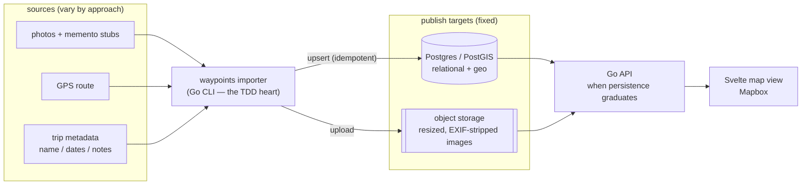
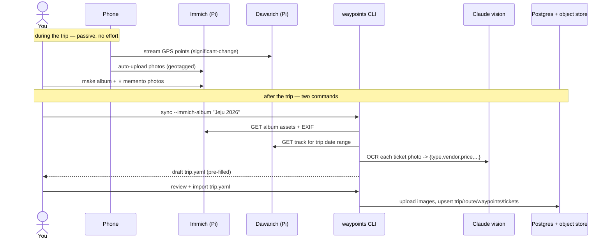
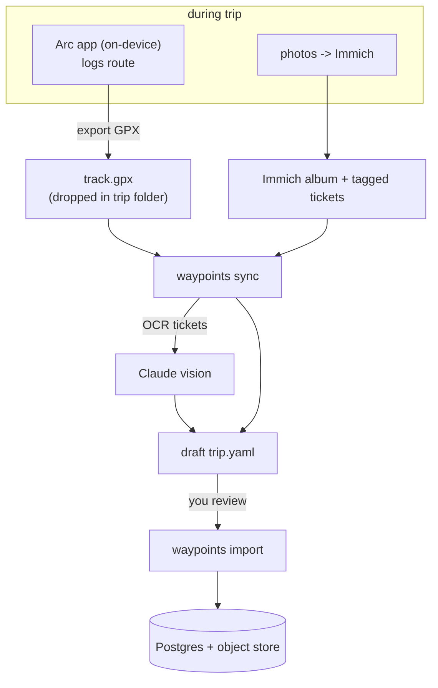
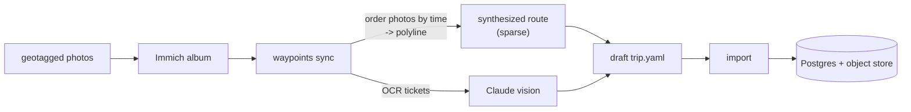
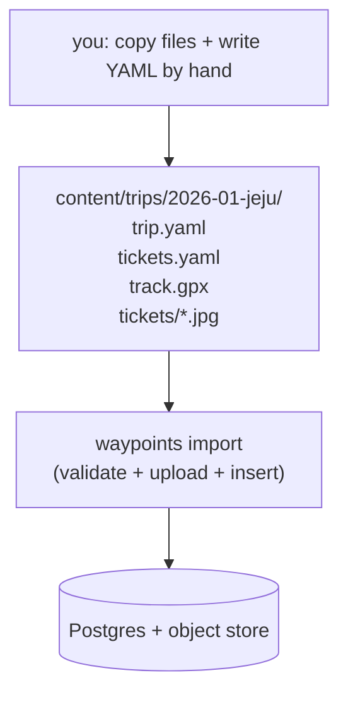
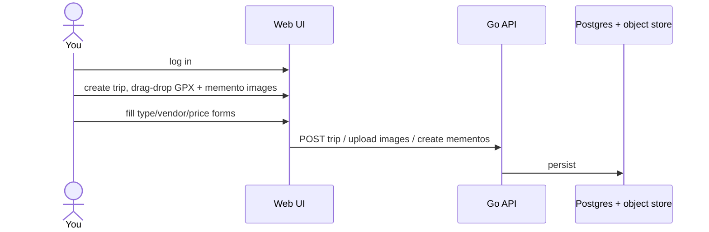
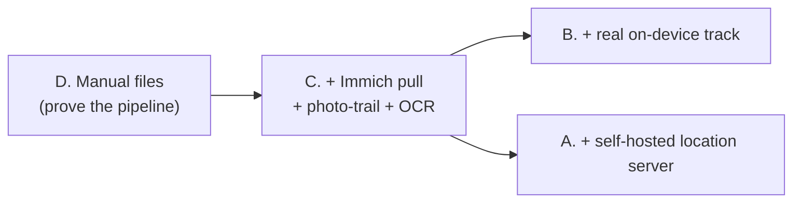

# Ingestion Workflows — comparing approaches

> The question this doc helps you answer: **"After a trip, what do *I* actually do to
> get it onto the map — and what does the system do for me?"**
>
> Everything downstream (the web app, map renderer, and eventual Go/Postgres persistence)
> is the same in every approach. What differs is the **ingestion path**: where the route
> comes from, where photos/mementos come from, and how much typing you do. This doc lays out
> five concrete end-to-end workflows so you can feel the trade-offs before we commit.

Reference look we're rebuilding: [`liuaaron-desktop.png`](./liuaaron-desktop.png) — dark
Mapbox map, orange route line, ticket-stub cards.

---

## What's fixed in every approach

**Invariants** (true no matter which workflow you pick):

- The importer is **idempotent** — re-running never duplicates; images are content-hashed.
- Postgres is a **rebuildable projection** — wipe it, re-run import, it's back.
- Public images are **resized + EXIF-stripped** (your home GPS never leaves the Pi).
- A **ticket stub is just a geotagged photo** — its `where`/`when` come free from EXIF;
  only `type/vendor/price` need to come from somewhere (you, or a vision model).

The approaches differ on three axes:

| Axis | Options |
| --- | --- |
| **Route source** | self-hosted location server · on-device app export · synthesized from photos · drawn by hand |
| **Photo source** | Immich API (auto) · manual file drop |
| **Ticket metadata** | vision-LLM pre-fills (you confirm) · you type it in YAML · you type it in a web form |

---

## Approach A — Fully self-hosted & automated

**Bundle:** Immich (photos) + Dawarich (route) + vision-LLM (ticket OCR) + object storage.
Two self-hosted sources on the Pi; the importer joins them on timestamp.

### What *you* do per trip

1. Travel. Phone passively logs location to Dawarich (battery-cheap; lasts days).
2. Photos auto-sync to Immich; you make an album `Jeju 2026` and ⭐/tag the ticket shots.
3. `waypoints sync --immich-album "Jeju 2026"` → get a **draft YAML**, pre-filled.
4. Skim the draft, fix the odd wrong price, commit to git.
5. `waypoints import content/trips/2026-01-jeju.yaml`.

- ✅ Lowest per-trip toil; richest data; fully sovereign; great TDD surface (sync joins
  two recorded API responses → pure functions).
- ❌ Two self-hosted services to run/back up; LLM dependency for OCR; most to build.

---

## Approach B — On-device track, no extra server

**Bundle:** Immich (photos) + **Arc app** GPX export (route) + vision-LLM + object storage.
Only *one* self-hosted source. The route arrives as a file you drop in the trip folder.

### What *you* do per trip

1. Travel. **Arc** logs your route on-device (low battery, no server).
2. Photos → Immich as usual; album + ⭐ tickets.
3. Export the days as GPX from Arc → drop into `content/trips/2026-01-jeju/track.gpx`.
4. `waypoints sync --immich-album "Jeju 2026" --track track.gpx` → draft YAML.
5. Review, commit, `import`.

- ✅ One less server than A; route data still real & precise; data stays on your phone
  until you choose to export.
- ❌ One manual step per trip (export + drop the GPX); Arc is iOS-only and paid.

---

## Approach C — Minimal: photo-trail only

**Bundle:** Immich only. **No GPS tooling at all.** The route is *synthesized* by connecting
your geotagged photos in time order.

### What *you* do per trip

1. Travel + shoot photos (they're geotagged automatically).
2. Album + ⭐ tickets in Immich.
3. `waypoints sync --immich-album "Jeju 2026"` → draft YAML (route inferred from photos).
4. Review, commit, `import`.

- ✅ Zero extra tooling; nothing new to run; simplest possible start.
- ❌ Route is **sparse and jumpy** — it hops between photo spots, not a true path
  (fine for a city day, poor for a long drive). Easy to **upgrade later** to A or B
  (drop in a real track and the importer prefers it).

---

## Approach D — Manual git-as-CMS (no Immich pull)

**Bundle:** You assemble each trip folder by hand — copy images in, write all YAML yourself.
The importer only validates, uploads, and inserts. Maximum control, maximum toil.

### What *you* do per trip

1. Copy chosen photos/ticket scans into `content/trips/2026-01-jeju/`.
2. Hand-write `trip.yaml` + `tickets.yaml` (every field, every coordinate).
3. (Optional) drop a `track.gpx`.
4. `waypoints import` → validate + upload + insert.

- ✅ No Immich/LLM/location-server dependencies; importer is tiny; total control; the
  thinnest first slice to prove the pipeline end-to-end.
- ❌ Most typing per trip; you manually transcribe ticket fields and coordinates. Realistic
  as a **v1 to bootstrap TDD**, then layer A/B/C on top.

---

## Approach E — Web authoring UI (no files, DB-first)

**Bundle:** a Svelte authoring app: log in, create a trip, drag-drop GPX + memento images,
fill metadata in forms. The DB is the source of truth; no content repo.

### What *you* do per trip

1. Open the web app and log in.
2. Create trip; drag-drop GPX and images; type metadata in forms; save.

- ✅ Point-and-click, nothing on the command line; edit anything live; no git step.
- ❌ Most frontend to build & test; no versioned history/diff; you still type every ticket
  field manually (unless we also add the vision-LLM here); DB is the only copy of your
  curation (back it up well).

---

## Side-by-side

| | A. Self-hosted auto | B. On-device track | C. Photo-trail | D. Manual files | E. Admin UI |
| --- | --- | --- | --- | --- | --- |
| **Per-trip effort** | tag album → 2 cmds | tag + export GPX → 2 cmds | tag album → 2 cmds | write all YAML | fill web forms |
| **Route quality** | ★★★ true track | ★★★ true track | ★ sparse/jumpy | ★★★ if you add GPX | ★★★ if you upload GPX |
| **Ticket metadata** | LLM pre-fills | LLM pre-fills | LLM pre-fills | you type | you type (forms) |
| **New deps to run** | Immich + Dawarich | Immich (+ Arc app) | Immich | none | none |
| **Sovereignty** | full | full | full | full | full |
| **Versioned history** | ✅ git | ✅ git | ✅ git | ✅ git | ❌ DB only |
| **Build cost** | high | med-high | med | low | high (frontend) |
| **TDD fit** | ★★★ | ★★★ | ★★★ | ★★★ | ★★ |

---

## How they relate (you can start small and grow)

The importer's **internal contract is identical** across A–D — they only swap the *route
provider* and the *photo provider* behind interfaces. So we can ship **D first** (smallest,
fully testable), then add the Immich provider (→C), then a track provider (→A or B) as later
milestones — no rewrites, just new implementations of the same Go interfaces. E is a
different branch (DB-first, big frontend) and would be additive, not foundational.

---

## My read (for when you're ready to decide)

- **Build order:** start at **D** (thin, TDD-clean), grow to **C**, then **A**. This honors
  the unhurried 6-month plan and de-risks each layer.
- **Target steady-state:** **A** — it's the only one that matches the reference's clean
  multi-day route with near-zero per-trip toil, and it fits your self-hosted ethos.
- **Track source** decides A-vs-B: **Dawarich+Overland** (server, auto) vs **Arc** (on-device,
  one manual export). **Storage**: **R2** (CDN'd via your tunnel edge) vs **MinIO** (on-Pi).

Open the two screenshots alongside this and tell me which workflow *feels* right to live
with after every trip — that instinct matters more than the build cost.

---

## Chosen direction (2026-06-10)

**A + E.** Auto pipeline (A) seeds raw materials; admin UI (E) is for authorship.

- **DB is canonical.** Importer upserts **ingested fields only** (route, stub image, geo,
  time, OCR'd `type/vendor/price`, `source_ref`) — **never** overwrites **authored fields**
  (`title`, `essay`, `animation`, photo curation). Re-import is always safe.
- **Admin UI** adds photos via **drag-drop upload _or_ an Immich picker**.
- **`waypoints export`** dumps DB → YAML into git as a versioned backup (one-way; DB stays
  the source of truth).
- **Content model:** `Journey → Ticket(→ essay + extra photos + open-animation)`; the
  **ticket is the click target**. See the ER diagram in `docs/design.md` (to be written).
- **Open decisions:** object storage (R2 vs MinIO); ticket-open animation style
  (flip / morph / tear — to prototype in the frontend milestone).
