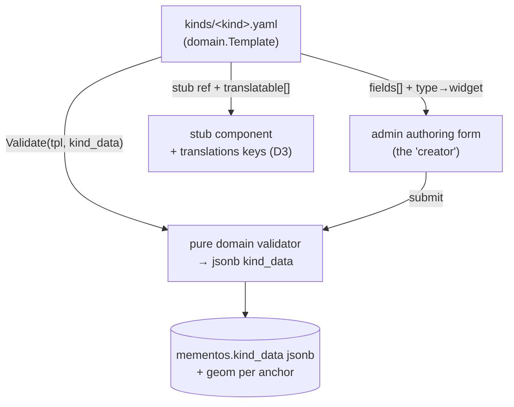

# Research — the declarative memento-template registry

> 2026-07-09. felicia needs to author _custom data types from the UI_: fill a form for a
> transit ticket (from→to), a **live** (concert/event) ticket, a goshuin stamp — and get a
> rendered memento back. This note designs the **declarative kind-template registry** that
> makes each such type **data, not code**. It generalizes the one-off
> [transit creator](transit-tickets.md) into the mechanism behind _every_ authored kind, and
> makes concrete the template-first stub rendering settled in
> [`mementos-not-tickets.md`](mementos-not-tickets.md). Outcome ADR:
> `felicia:decision:memento-template-registry` (refines `memento-not-ticket`; see also
> [`backend-stack.md`](backend-stack.md) D9). Research-stage — design vocabulary + the
> validation contract the first TDD encodes; a goose/spec artifact comes at S-phase.

## The problem

A `kind` (transit, live, goods, stamp, receipt, souvenir…) needs three things that must
never disagree:

1. an **authoring form** — the fields the user fills in the admin app;
2. a **validation** of the stored `kind_data` (jsonb, D1) — so a bad blob never reaches the DB;
3. a **stub render** + the set of **translatable** fields (D3 i18n sidecar).

Hardcoding those three per kind in Go triplicates the same field list and drifts. Kinds
genuinely proliferate (the collector niche — _eki_ stamps, _goshuin_, character goods,
_omiyage_ — is the whole point, `mementos-not-tickets.md`). So the field list is declared
**once, as data**, and all three surfaces derive from it.

## The template

One declaration per kind. YAML on disk (bundled fixtures, committed), parsed at the edge
into a `domain.Template`:

```yaml
# kinds/transit.yaml
kind: transit
anchor: edge # from→to : geom is a LineString
stub: transit # frontend component id
fields:
  - { name: operator, type: text, required: true, translatable: true }
  - { name: line, type: text, required: false, translatable: true }
  - { name: from, type: station, required: true } # resolves via D4 catalog
  - { name: to, type: station, required: true }
  - { name: fare, type: money, required: false }
```

```yaml
# kinds/live.yaml   — a concert / event ("live") ticket
kind: live
anchor: point # one place : geom is a Point
stub: live
fields:
  - { name: artist, type: text, required: true, translatable: true }
  - { name: venue, type: venue, required: true } # named place + coord
  - { name: date, type: datetime, required: true }
  - { name: seat, type: text, required: false }
  - { name: setlist_url, type: url, required: false }
```

### The `anchor` — point vs edge

The one structural axis (from `transit-tickets.md`): **`point`** kinds carry a single coord
(`geom` = Point); **`edge`** kinds carry a from→to (`geom` = LineString, and the leg composes
into the display route, D2). `anchor` is the template's contract with the geometry column —
the validator enforces it (below), and route assembly reads it.

### The field `type` catalog (closed, small)

Extend only by rule-of-three. A `type` fixes validation, the default form widget, and any
resolver:

| `type`     | Value shape in `kind_data`                       | Resolver / widget                       | Notes                                      |
| ---------- | ------------------------------------------------ | --------------------------------------- | ------------------------------------------ |
| `text`     | string                                           | text input                              | the only commonly `translatable` type      |
| `money`    | `{ amount: int minor-units, currency: ISO4217 }` | amount + currency                       | mirrors `price_*` (D6); never translatable |
| `date`     | `YYYY-MM-DD`                                     | date picker                             |                                            |
| `datetime` | RFC3339 instant                                  | datetime picker                         | pairs with `occurred_tz`                   |
| `station`  | `{ name, name_ja, coords, operator?, line? }`    | autocomplete vs. **D4 station catalog** | writes denormalized; feeds `edge` geom     |
| `venue`    | `{ name, coords }`                               | map-pick / place search                 | feeds `point` geom for events              |
| `url`      | string (http/https)                              | url input                               |                                            |
| `enum`     | string ∈ declared values                         | select                                  | values declared inline on the field        |

`translatable: true` is only meaningful on `text` (and the `name` sub-field of
`station`/`venue`): those field values are lifted into `translations` keyed
`kind_data.<field>` (D3), JP inline / EN·ZH in the sidecar. `money`, coords, instants, urls
are **never** translated.

## One declaration, three consumers



- **Form** — the transit creator (`transit-tickets.md`) is now just _the `transit` template
  rendered_. A new kind ships a `.yaml` + a stub component; **no new form code**.
- **Validator** — pure `internal/domain`, the first TDD target (below). No DB, no network.
- **Render + i18n** — the `stub` id selects the frontend component; `translatable` fields
  enumerate the D3 sidecar keys automatically.

This is the **E** (author) half of the A+E model. The **A** (auto-ingest) half —
Dawarich + Immich (`source-connectors.md`) — lands mementos through the _same_ seam: an
importer-produced `kind_data` is validated by the exact same `Validate`, so ingest and
manual authoring can never produce divergent blobs.

## The validation contract (what the TDD encodes)

`Validate(tpl domain.Template, data map[string]any) []Issue` — **pure**, deterministic,
returns all issues (not fail-fast), each with a field path + code:

| Code               | Condition                                                                                                                                                        |
| ------------------ | ---------------------------------------------------------------------------------------------------------------------------------------------------------------- |
| `required_missing` | a `required` field is absent or null                                                                                                                             |
| `unknown_field`    | `data` has a key not in `tpl.fields`                                                                                                                             |
| `type_mismatch`    | value doesn't match the field `type`'s shape (e.g. `money.amount` not an int, `url` not http(s), `enum` value not in the declared set, `station` missing coords) |
| `anchor_mismatch`  | `edge` template lacks a resolvable from **and** to (→ no LineString); `point` template lacks exactly one coord-bearing field (→ no Point)                        |
| `bad_currency`     | `money.currency` not a 3-letter ISO-4217 code                                                                                                                    |

Rules the contract fixes:

- **Closed field set.** Unknown keys are an error, not silently kept — the template is the
  whole schema of `kind_data`.
- **`anchor` drives geometry.** `edge` ⇒ both endpoint fields (`station`/`venue`) must
  resolve to coords so the LineString is buildable; `point` ⇒ exactly one coord-bearing
  field. The validator, not the caller, owns this invariant.
- **Optional-and-absent is valid**; optional-and-present is type-checked.
- **`kind` must be registered.** Validating against an unknown kind is itself an error
  (`Registry.Template(kind)` returns not-found) — the DB `kind` column is a soft enum whose
  legal set _is_ the registry (D8/D9).

`Registry` = `map[kind]Template` loaded from the `kinds/` dir at startup; loading is at the
edge (YAML parse), `Validate` stays pure over the parsed `Template`.

## What this is _not_ (guardrail)

The template declares **fields, an anchor, and refs** — full stop. It does **not** express
mapping, queries, computation, or conditional logic. That would recreate the "generic
config-query engine" trap already rejected for source connectors
([`source-connectors.md`](source-connectors.md) §"Why the generic version bites"). Assembly
and any derivation stay Go. If a kind ever needs behavior a declaration can't express, it
gets a small Go hook keyed by `kind` — the registry stays declarative, the exception stays
code.

## Open

- **Stub-template binding.** `stub: transit` is a frontend component id today. Whether the
  visual template itself becomes data (a spec of shapes/slots) or stays a hand-built
  component (liuaaron-style, `liuaaron-teardown.md`) is a _frontend_ question — deferred; the
  backend only stores the id.
- **Field-type extensions.** `venue` resolution (map-pick vs. a place search service) and
  whether `station` and `venue` converge once a general "named coord" need appears
  (rule-of-three).
- **Template versioning.** If a shipped kind's field set changes, do stored `kind_data`
  blobs need a `template_version` for migration? Likely yes once real data exists; out of
  scope for the first validator.
- **Which kinds ship first** — carries the `mementos-not-tickets.md` taste test: `goods`,
  the JR-style `transit` mag-stripe, then `live`.
