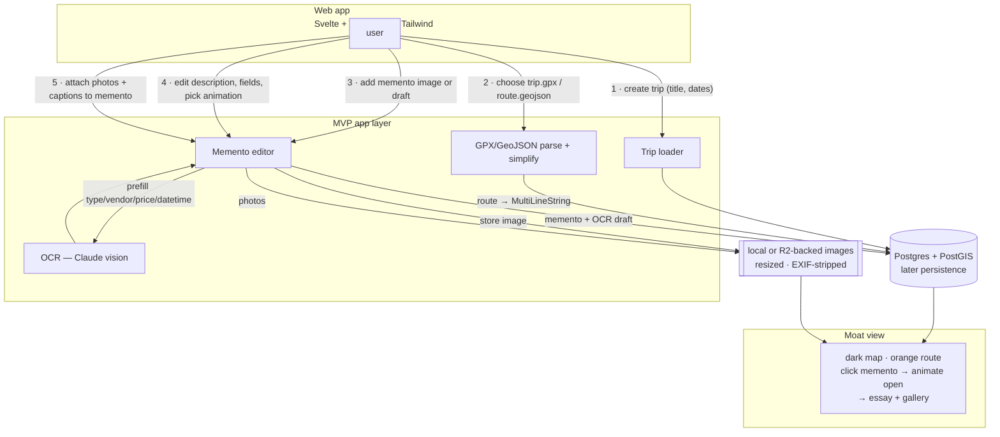
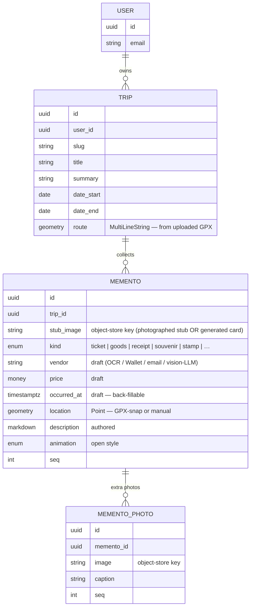
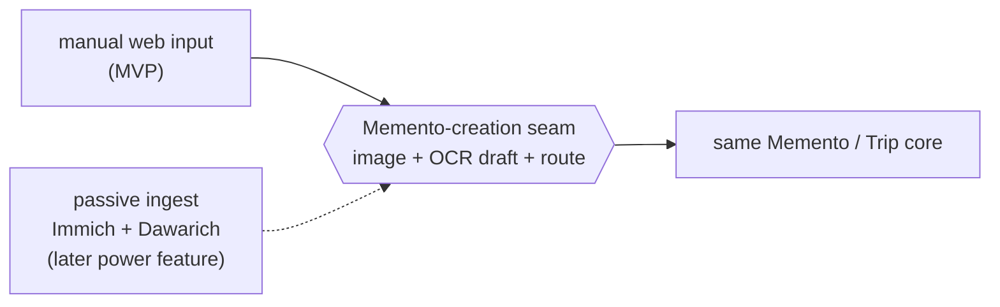

# Research — manual-input dataflow

> 2026-06-12. A SaaS-first reframe of how data gets into felicia. Where the archived
> design assumed a **passive, self-hosted ingest** pipeline (Immich + Dawarich joined on
> timestamp), this models the simplest thing that works without passive ingest: **manual
> route and memento input.** Research-stage sketch — a candidate, not a spec. Sits
> downstream of [`product-vs-personal.md`](product-vs-personal.md) and the
> [direction](../direction.md).

> **Updated 2026-06-14:** the "ticket" here generalizes to **memento** (`kind`-tagged) —
> see [`mementos-not-tickets.md`](mementos-not-tickets.md). The flow below is unchanged in
> shape; the stub-creation step (3) just accepts more sources (Wallet `.pkpass`, email,
> goods-photo + vision-LLM) behind the _same seam_, and `TICKET` below is now `MEMENTO`.

> **Updated 2026-06-23:** the active MVP UI stack is **Svelte + TypeScript + Tailwind**.
> **Updated 2026-07-01:** the map renderer is **MapLibre GL** for token-free OSS local demos.
> There is no desktop plan yet.

## The reframe in one line

Make the **GPX/GeoJSON a manual per-trip input** and let the user **attach photos to
mementos by hand**, and the hardest parts of the old design evaporate — no Immich, no
Dawarich, no passive logging, no timestamp-join, no waypoint clustering. **The user is the
joiner.** What survives is the one automation actually worth its weight: **OCR prefill.**

## The flow

1. **Create/load trip** — title, dates, and one real content record. Accounts are not part
   of the MVP.
2. **Choose GPX/GeoJSON** — parse + simplify (Douglas–Peucker) → route line on the map. One
   file per trip.
3. **Add a memento** — add an image or draft → stored (resized, EXIF-stripped) → **Claude
   vision OCR** prefills `type / vendor / price / occurred_at`. The memento renders as an
   animatable stub.
4. **Edit** — user fixes the OCR draft and writes the **description (essay)**, picks the
   open-animation.
5. **Attach photos** — a few more images per memento, each with its own caption.
6. **View** — map: orange route + memento stubs; click → animate open → essay + gallery.

## Data model (product-ready)

Everything hangs off `USER` — that's the single account root from
[`direction.md`](../direction.md), now load-bearing.

## The insight worth keeping

**Manual input and passive auto-ingest are two source implementations behind the same
Memento-creation seam.** Both end at the same place: an image in storage + an OCR'd draft +
a route on the trip. So the simple local path _is_ the core; the old Immich/Dawarich passive
pipeline becomes a **power feature bolted on later** as a second source. We're not
discarding the archived design — we're inverting which half ships first, and the
swappable-seam bet from `direction.md` is exactly what makes that cheap.

## The one real design choice: where does a memento sit on the map?

- **OCR time → snap to GPX** at `occurred_at` → auto-place the point. Magic when both exist.
- **Manual map-drag** override / fallback when there's no GPX or no usable time.
  ← **recommended baseline** (always available), with GPX-snap as the assist.
- Pure EXIF — we strip it for privacy, so it's unreliable for public render. Skip.

## MVP scope (the "keep it simple" cut)

- **In:** Svelte + TypeScript + Tailwind UI, trips, GPX/GeoJSON route file, memento image +
  OCR + edit, memento photos, public view, one designed stub, one open animation.
- **Defer:** billing, passive auto-ingest, printed books, teams/sharing, and a full
  animation library.
- **Watch:** OCR cost per memento (Claude vision calls) — fine at MVP volume; revisit if it
  scales.

## Open questions

- Auth provider — roll-your-own email vs. a hosted identity (cost vs. control).
- Object-storage key scheme + per-tenant isolation (cheap to get right now, painful later).
- OCR confidence + the edit UX — how much to trust the draft vs. force review.
- Does manual route input feel good enough, or is "no track" the common case (then the
  photo-trail fallback from the archived design earns its place)?
