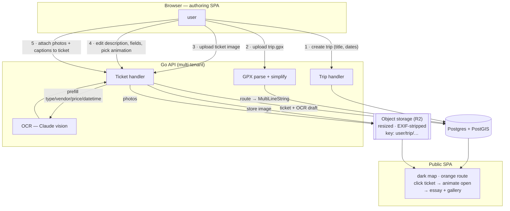
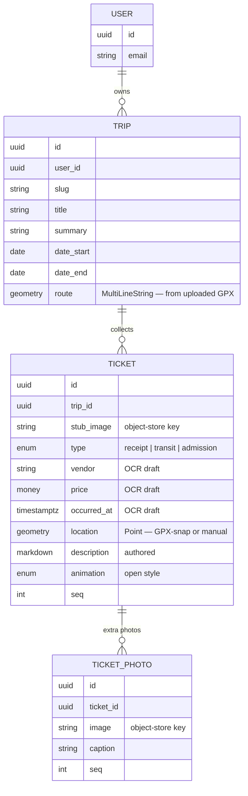
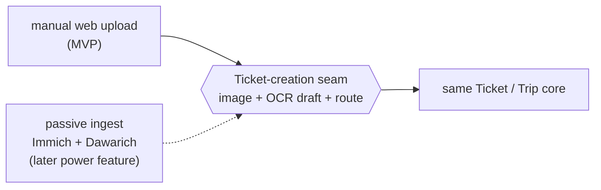

# Research — SaaS-manual dataflow

> 2026-06-12. A SaaS-first reframe of how data gets into felicia. Where the archived
> design assumed a **passive, self-hosted ingest** pipeline (Immich + Dawarich joined on
> timestamp), this models the simplest thing that works for *any* user: **they upload
> everything through a web app.** Research-stage sketch — a candidate, not a spec. Sits
> downstream of [`product-vs-personal.md`](product-vs-personal.md) and the
> [direction](../direction.md).

## The reframe in one line

Make the **GPX a manual per-trip upload** and let the user **attach photos to tickets by
hand**, and the hardest parts of the old design evaporate — no Immich, no Dawarich, no
passive logging, no timestamp-join, no waypoint clustering. **The user is the joiner.**
What survives is the one automation actually worth its weight: **OCR prefill.**

## The flow

1. **Create trip** — title, dates. Owned by the user (multi-tenant from day one — the
   "most SaaS" part).
2. **Upload GPX** — server parses + simplifies (Douglas–Peucker) → route line on the map.
   One file per trip.
3. **Add a ticket** — upload the stub image → stored (resized, EXIF-stripped) → **Claude
   vision OCR** prefills `type / vendor / price / occurred_at`. The ticket renders as an
   animatable stub.
4. **Edit** — user fixes the OCR draft and writes the **description (essay)**, picks the
   open-animation.
5. **Attach photos** — a few more images per ticket, each with its own caption.
6. **Publish** — public map: orange route + ticket stubs; click → animate open → essay +
   gallery.

## Data model (multi-tenant)

Everything hangs off `USER` — that's the single account root from
[`direction.md`](../direction.md), now load-bearing.

## The insight worth keeping

**Manual web-upload and passive auto-ingest are two source implementations behind the same
Ticket-creation seam.** Both end at the same place: an image in object storage + an OCR'd
draft + a route on the trip. So the simple SaaS path *is* the core; the old Immich/Dawarich
passive pipeline becomes a **power feature bolted on later** as a second source. We're not
discarding the archived design — we're inverting which half ships first, and the
swappable-seam bet from `direction.md` is exactly what makes that cheap.

## The one real design choice: where does a ticket sit on the map?

- **OCR time → snap to GPX** at `occurred_at` → auto-place the point. Magic when both exist.
- **Manual map-drag** override / fallback when there's no GPX or no usable time.
  ← **recommended baseline** (always available), with GPX-snap as the assist.
- Pure EXIF — we strip it for privacy, so it's unreliable for public render. Skip.

## MVP scope (the "keep it simple" cut)

- **In:** basic auth (email or one OAuth), trips, GPX upload, ticket image + OCR + edit,
  ticket photos, public view.
- **Defer:** billing (free beta), passive auto-ingest, printed books, teams/sharing, an
  animation library (ship *one* animation, add more later).
- **Watch:** OCR cost per ticket (Claude vision calls) — fine at MVP volume; revisit if it
  scales.

## Open questions

- Auth provider — roll-your-own email vs. a hosted identity (cost vs. control).
- Object-storage key scheme + per-tenant isolation (cheap to get right now, painful later).
- OCR confidence + the edit UX — how much to trust the draft vs. force review.
- Does manual GPX upload feel good enough, or is "no track" the common case (then the
  photo-trail fallback from the archived design earns its place)?
